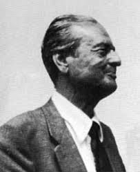

```{r setup, include=FALSE}
knitr::opts_chunk$set(echo = TRUE,
                      fig.align = "center",
                      fig.retina = 3)
```

<link rel="stylesheet" href="https://cdn.rawgit.com/jpswalsh/academicons/master/css/academicons.min.css"/>

A estatística Bayesiana^[maiúsculo, pois se refere ao teorema de Bayes que é um sobrenome.] é uma abordagem de análise de dados baseada no teorema de Bayes, onde o conhecimento disponível sobre os parâmetros em um modelo estatístico é atualizado com as informações dos dados observados [@gelman2013bayesian]. O conhecimento prévio é expresso como uma distribuição *a priori*^[do inglês *prior distribution*.] e combinado com os dados observados na forma de uma função de verossimilhança^[do inglês *likelihood function*.] para determinar a distribuição *a posteriori*^[do inglês *posterior distribution*] . A *posteriori* também pode ser usada para fazer previsões sobre eventos futuros.

Estatística Bayesiana está revolucionando todos os campos das ciências baseadas em evidências^[pessoalmente, como um bom Popperiano, não acreditado que haja ciência sem ser baseada em evidências; o que não usa evidências pode ser considerado como filosofia (ex: matemática) ou práticas sociais (não menos ou mais importantes que a ciência, apenas uma demarcação do que é ciência e do que não é; ex: direito).] [@vandeschootBayesianStatisticsModelling2021]. A insatisfação com métodos tradicionais de inferência estatística (estatística frequentista) e o advento dos computadores com o crescimento exponencial de poder computacional^[seu smartphone (iPhone 12 - 4GB RAM) possui 1.000.000x (1 milhão) mais poder computacional que o computador de bordo da Apollo 11 (4kB RAM) que levou o homem à lua. Detalhe: esse computador de bordo era responsável pela navegação, rota e controles do módulo lunar.] proporcionaram a ascensão da estatística Bayesiana por ser uma abordagem robusta à más-práticas científicas porém computacionalmente intensiva.

Porém antes de entrarmos em estatística Bayesiana, temos que falar de probabilidade: o motor da inferência Bayesiana.

## O que é probabilidade?

> Probabilidade não existe!
>
> @definettiTheoryProbability1974^[caso o leitor queira uma discussão aprofundada veja @nauFinettiWasRight2001.]

Essas são as primeiras palavras no prefácio do célebre livro de [Bruno de Finetti](https://en.wikipedia.org/wiki/Bruno_de_Finetti) (figura \@ref(fig:finetti)), um dos mais importantes matemáticos e filósofos da probabilidade. Sim, a probabilidade não existe. Ou melhor, probabilidade como uma quantidade física, chance objetiva, **NÃO existe**. De Finetti mostrou que, em certo sentido preciso, se dispensarmos a questão da chance objetiva *nada se perde*. A matemática do raciocínio indutivo permanece **exatamente a mesma**.

```{r finetti, echo=FALSE, fig.cap='Bruno de Finetti. Figura de https://www.wikipedia.org', out.extra='class=external'}

```

Considere jogar uma moeda de enviesada. As tentativas são consideradas independentes e, como resultado, exibem outra propriedade importante. **A ordem não importa**. Dizer que a ordem não importa é dizer que se você pegar qualquer sequência finita de cara e coroa e permutar os resultados da maneira que quiser, a sequência resultante terá a mesma probabilidade. Dizemos que essa probabilidade é **invariante sob permutações**.

Ou, dito de outra forma, a única coisa que importa é a frequência relativa. As sequências de resultados que têm as mesmas frequências de cara e coroa consequentemente possuem a mesma probabilidade. A frequência é considerada uma **estatística suficiente**^[do inglês *sufficient statistic*.]. Dizer que a ordem não importa ou dizer que a única coisa que importa é a frequência são duas maneiras de dizer exatamente a mesma coisa. Essa propriedade é chamada de **permutabilidade** por de Finetti. E é a mais importantes propriedade da probabilidade que faz com que possamos manipulá-la matematicamente (ou filosoficamente) mesmo que ela não exista como uma "coisa" física.

Ainda desenvolvendo o argumento: "O raciocínio probabilístico –-sempre entendido como subjetivo-– decorre apenas da incerteza de algo. Não faz diferença se a incerteza diz respeito a um futuro imprevisível^[observação minha: relacionado à abordagem Bayesiana subjetiva.], ou a um passado despercebido, ou a um passado duvidosamente relatado ou esquecido^[observação minha: relacionado à abordagem frequentista objetiva.]... A única coisa relevante é a incerteza -- a extensão de nosso próprio conhecimento e ignorância. O fato real de se os eventos considerados são ou não determinados em algum sentido, ou conhecidos por outras pessoas, e assim por diante, é irrelevante" (tradução minha de @definettiTheoryProbability1974).

Concluindo: não importa o que é probabilidade, você consegue usá-la de qualquer maneira, mesmo que ela seja um frequência absoluta (ex: probabilidade de eu plantar bananeira de sunga na Avenida Paulista é ZERO pois a probabilidade de um evento que nunca ocorreu ocorrer no futuro é ZERO) ou um palpite subjetivo (ex: talvez a probabilidade não seja ZERO, mas 0,00000000000001; bem improvável, mas não impossível).

### Definição Matemática

Com a intuição filosófica de probabilidade elaborada, vamos às intuições matemáticas. A probabilidade de um evento é um número real^[um número que pode ser expressado como um ponto em uma linha contínua que se origina em menos infinito e termina e mais infinito $(-\infty, +\infty)$; para quem gosta de computação é um ponto flutuante `float` ou `double`.] entre 0 e 1, onde, grosso modo, 0 indica a impossibilidade do evento e 1 indica a certeza. Quanto maior a probabilidade de um evento, mais provável é que o evento ocorrerá. Um exemplo simples é o lançamento de uma moeda justa (imparcial). Como a moeda é justa, os dois resultados ("cara" e "coroa") são igualmente prováveis; a probabilidade de "cara" é igual à probabilidade de "coroa"; e uma vez que nenhum outro resultado é possível, a probabilidade de "cara" ou "coroa" é 1/2 (que também pode ser escrita como 0,5 ou 50%).

Sobre notação, definimos que $A$ é um evento e $P(A)$ a probabilidade do evento, logo:

$$
\{P(A) \in \mathbb{R} : 0 \geq P(A) \geq 1 \}
$$

Isto quer dizer o "probabilidade do evento A ocorrer é o conjunto de todos os numeros reais entre 0 e 1; incluindo 0 e 1". Além disso temos três axiomas^[na matemática axiomas são afirmações pressupostas como verdadeiras que servem como premissas or pontos de partidas para elaboração de argumentos e teoremas. Muitas vezes os axiomas são questionáveis, por exemplo geometria não-Euclidiana refuta o quinto axioma de Euclides sobre linhas paralelas. Até agora não há nenhum questionamento que tenha suportado o escrutínio do tempo e da ciência sobre os três axiomas da probabilidade], oriundos de @kolmogorovFoundationsTheoryProbability1933 (figura \@ref(fig:kolmogorov)):

1. **Não-negatividade**: Para todo $A$, $P(A) \geq 0$. Toda probabilidade é positiva (maior ou igual a zero), independente do evento.
2. **Aditividade**: Para dois mutuamente exclusivos $A$ e $B$ (não podem ocorrer ao mesmo tempo ^[por exemplo, o resultado de uma moeda dado é um dos 2 eventos mutualmente exclusivos: cara ou coroa.]): $P(A) = 1 - P(B)$ e $P(B) = 1 - P(A)$.
3. **Normalização**: A probabilidade de todos os eventos possíveis $A_1, A_2, \dots$ devem somar 1: $\sum_{n \in mathbb{N}} A_n = 1$.

```{r kolmogorov, echo=FALSE, fig.cap='Andrey Nikolaevich Kolmogorov. Figura de https://www.wikipedia.org', out.extra='class=external'}
knitr::include_graphics("images/kolmogorov.jpg")
```

Com esses três simples (e intuitivos) axiomas, conseguimos derivar e construir toda a matemática da probabilidade.

### Probabilidade Condicional

Um conceito importante é a probabilidade condicional que podemos definir como "probabilidade de um evento ocorrer caso outro tenha ocorrido ou não". A notação que usamos é $P( A \mid B )$, que lê-se como "a probabilidade de observamos $A$ dado que já observamos $B$".

Um bom exemplo é o jogo de Poker Texas Hold'em, onde o jogador recebe duas cartas e podem utilizar mais cinco cartas comunitárias para montar sua "mão". A probabilidade de você receber um Rei ($K$) é $\frac{4}{52}$:

$$
P(K) = \left(\frac{4}{52}\right) = \left(\frac{1}{13}\right)
$$

E a probabilidade de você receber um Ás ($A$) também é $\frac{4}{52}$:

$$
P(A) = \left(\frac{4}{52}\right) = \left(\frac{1}{13}\right)
$$

Porém a probabilidade de você receber um Rei como segunda carta dado que você recebeu um Ás como primeira carta é:

$$
P(K | A) = \left(\frac{4}{51}\right)
$$

Como temos uma carta a menos $51$ já que você recebeu o Ás (visto que $A$ foi observado), temos 4 Reis ainda no baralho, logo $\frac{4}{52}$.

### Probabilidade Conjunta

Probabilidade Condicional não é "comutativa"

$$P(A|B) \neq P(B|A)$$

$$P(\text{covid} | \text{febre}) \neq P(\text{febre} | \text{covid})$$

### Abordagem Frequentista

* Frequência

### Abordagem Bayesiana

* Degree of Belief

### Exemplo Prático

Imagine que você está avaliando um jogador de basquete. Você precisa decidir se irá contratá-lo para o seu time. A principal característica que você examinará será a taxa de acerto de cestas de 3 pontos. Esse é o nosso parâmetro de interesse e a partir de agora vamos chamá-lo de $\theta$ (letra grega^[na estatística geralmente temos a convenção de usar letras romanas ($a, b, c, d, \dots$) para quantidades que sabemos o valor (exemplo: média de uma amostra); e letras gregas ($\alpha, \beta, \gamma, \dots$) para quantidades que não sabemos o valor preciso e queremos estimar (exemplo: média de uma população estimada a partir da média de uma amostra).] theta). $\theta$ pode assumir qualquer valor entre 0 e 1, sendo 0 representando uma taxa de acerto de 0% do jogador---ele *sempre erra* as tentativas de cestas de 3 pontos; e 1 representando uma taxa de acerto 100% do jogador--- ele *sempre acerta* as tentativas de cestas de 3 pontos.

É claro que $\theta$ raramente será 0 ou 1, mas sim um valor entre esses dois extremos. Podemos representar $\theta$ com uma distribuição beta. A distribuição beta é especificada por dois parâmetros com valores sempre positivos ($\geq 0$): $\alpha$^[letra grega alpha.] e $\beta$^[letra grega beta.]. Você pode pensar em $\alpha - 1$ como o número de acertos e $\beta - 1$ como o número de erros. Na figura \@ref(fig:dist-beta-1) é possível ver uma distribuição beta para vários valores iguais de parâmetros $\alpha$ e $\beta$. Veja que conforme o valor de $\alpha$ e $\beta$ aumentam a probabilidade de $\theta$ tende a convergir para o valor de 0.5 (50%).

```{r dist-beta-1, fig.cap='Comparativo de Distribuições Beta -- Valores Iguais de $\\alpha$ e $\\beta$'}
library(ggplot2)
theme_set(theme_minimal())

ggplot(data = data.frame(x = c(0, 1))) +
  labs(
    title = "Comparativo de Distribuições Beta",
    subtitle = expression(alpha == beta),
    x = expression(theta),
    y = "Densidade",
    color = "Parâmetros"
  ) +
  stat_function(aes(color = "list(alpha, beta) ==  1"), fun = dbeta, args = list(
    shape1 = 1, shape2 = 1), size = 2) +
  stat_function(aes(color = "list(alpha, beta) ==  2"), fun = dbeta, args = list(
    shape1 = 2, shape2 = 2), size = 2) +
  stat_function(aes(color = "list(alpha, beta) ==  3"), fun = dbeta, args = list(
    shape1 = 3, shape2 = 3), size = 2) +
    stat_function(aes(color = "list(alpha, beta) ==  4"), fun = dbeta, args = list(
    shape1 = 4, shape2 = 4), size = 2) +
  scale_color_brewer(palette = "Set1",
    labels = scales::label_parse())
```

Conforme os valores de $\alpha$ e $\beta$ diferem um do outro começamos a ver a probabilidade de $\theta$ se distanciar de 0.5 e a distribuição começa a ser assimétrica, tendenciando para algum extremo. Na figura \@ref(fig:dist-beta-2) é possível ver uma distribuição beta para vários valores diferentes de parâmetros $\alpha$ e $\beta$.

```{r dist-beta-2, fig.cap='Comparativo de Distribuições Beta -- Valores Diferentes de $\\alpha$ e $\\beta$'}
library(ggplot2)

ggplot(data = data.frame(x = c(0, 1))) +
  labs(
    title = "Comparativo de Distribuições Beta",
    subtitle = expression(alpha != beta),
    x = expression(theta),
    y = "Densidade",
    color = "Parâmetros"
  ) +
  stat_function(aes(color = "list(alpha == 3, beta == 2)"), fun = dbeta, args = list(
    shape1 = 3, shape2 = 2), size = 2) +
  stat_function(aes(color = "list(alpha == 2, beta ==  3)"), fun = dbeta, args = list(
    shape1 = 2, shape2 = 3), size = 2) +
  stat_function(aes(color = "list(alpha == 4, beta ==  2)"), fun = dbeta, args = list(
    shape1 = 4, shape2 = 2), size = 2) +
    stat_function(aes(color = "list(alpha == 2, beta ==  4)"), fun = dbeta, args = list(
    shape1 = 2, shape2 = 4), size = 2) +
  scale_color_brewer(palette = "Set1",
    labels = scales::label_parse())
```

## O que é o maldito $p$-valor?

Teste t: $P(D | \text{efeito nulo})$
ANOVA: $P(D|\text{não há diferença entre os grupos})$
Regressão: $P(D|\text{coeficiente é nulo})$
Shapiro-Wilk: $P(D|\text{amostra é normal})$

Mas o que estamos realmente interessados é na $P(H_0)$

## Teorema de Bayes

$$\underbrace{P(\theta|y)}_{\text{Posterior}} = \frac{\overbrace{P(y | \theta)}^{\text{Likelihood}} \cdot \overbrace{P(\theta)}^{\text{Prior}}}{\underbrace{P(y)}_{\text{Constante Normalizadora}}}$$$

Ranca fora a constante Normalizadora

$$\underbrace{P(\theta|y)}_{\text{Posterior}} \propto \overbrace{P(y | \theta)}^{\text{Likelihood}} \cdot \overbrace{P(\theta)}^{\text{Prior}} = \underbrace{P(\theta, y)}_{\text{Probabilidade Conjunta}}$$

$\propto$ (comando $\LaTeX$ `\propto`) quer dizer "proporcional à".

* Animação com uma distribuição beta de um flip of a coin com updated beliefs by posterior


## Vantagens da Estatística Bayesiana

* Abordagem Natural para expressar incerteza
* Habilidade de incorporar informações prévia
* Maior flexibilidade do modelo
* Distribuição posterior completa dos parâmetros
  * Intervalos de Confiança vs Intervalos de Credibilidade
  * Point Estimate vs Full Posterior Density
  * Mesmo com Intervalos de Confiança você está falando ainda de Point Estimate -- Optimization of Likelihood when the derivative is at zero
  * MLE estimation is the value of the parameters such that the most likely dataset of size N to randomly draw from a population is the dataset that you actually drew. Every other potential dataset that could be drawn from this population is going to fit worse than the dataset that you actually have.
* Propagação natural da incerteza

* Fisher — "were Fisher alive today, he would be a Bayesian"
    * Fisher published an article (Fisher, 1962) examining the possibilities of Bayesian methods, but with the prior probabilities to be determined experimentally!
    * Fisher, R. A. (1962), ‘Some examples of Bayes’ method of the experimental determination of probability a priori’, J. Roy. Stat. Soc. B 24, 118–124.

* Modelos hierárquicos. lme4 não computa p-valores para os random effects
* Exemplo do teste t normal e o bayesiano

## Desvantagens

* Velocidade lenta de estimativa do modelo (30 segundos ao invés de 3 segundos)

Falar do poder computacional — flops
Falar da facilidade de testes ortodoxos de computação

## Stan

```{r stan_billions}
knitr::include_graphics("images/stan_billions_subtitled.mp4")
```

* rstan
* rstanarm
* brms

## Ambiente

```{r SessionInfo}
sessionInfo()
```
