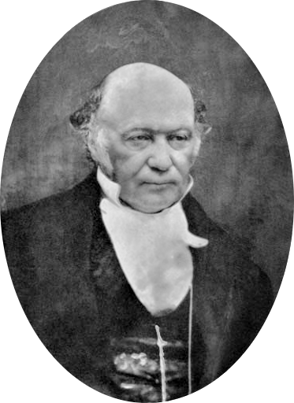

```{r setup, include=FALSE}
knitr::opts_chunk$set(echo = TRUE,
                      fig.align = "center",
                      fig.retina = 3)
set.seed(123)
```

<link rel="stylesheet" href="https://cdn.rawgit.com/jpswalsh/academicons/master/css/academicons.min.css"/>

A principal barreira computacional para estatística Bayesiana é o denominador $P(\text{data})$ da fórmula de Bayes:

$$P(\theta | \text{data})=\frac{P(\theta) \cdot P(\text{data} | \theta)}{P(\text{data})}$$

Em casos discretos podemos fazer o denominador virar a soma de todos os parâmetros usando a regra da cadeia de probabilidade:

$$P(A,B|C)=P(A|B,C) \times P(B|C)$$

Isto também é chamado de marginalização:

$$P(\text{data})=\sum_{\theta} P(\text{data} | \theta) \times P(\theta)$$

Porém no caso de valores contínuos o denominador $P(\text{data})$ vira uma integral bem grande e complicada de calcular:

$$P(\text{data})=\int_{\theta} P(\text{data} | \theta) \times P(\theta)d \theta$$

Em muitos casos essa integral vira *intratável* (incalculável) e portanto devemos achar outras maneiras de calcular a probabilidade posterior $P(\theta | \text{data})$ de Bayes sem usar o denominador $P(\text{data})$.

## Para quê serve o denominador $P(\text{data})$?

Para normalizar a posterior com o intuito de torná-la uma distribuição probabilística válida. Isto quer dizer que a soma de todas as probabilidades dos eventos possíveis da distribuição probabilística devem ser iguais a 1:

-   no caso de distribuição probabilística discreta: $\sum_{\theta} P(\theta | \text{data}) = 1$
-   no caso de distribuição probabilística contínua: $\int_{\theta} P(\theta | \text{data})d \theta = 1$

## Se removermos o denominador de Bayes o que temos?

Ao removermos o denominador $(\text{data})$ temos que a posterior $P(\theta | \text{data})$ é **proporcional** à prior multiplicada pela verossimilhança $P(\theta) \cdot P(\text{data} | \theta)$[^1].

[^1]: o símbolo $\propto$ (`\propto`) deve ser lido como "proporcional à".

$$P(\theta | \text{data}) \propto P(\theta) \cdot P(\text{data} | \theta)$$

Este [vídeo do YouTube](https://youtu.be/8FbqSVFzmoY) explica muito bem o problema do denominador.

<div class="resp-container">
<iframe class="testiframe" width="560" height="315" src="https://www.youtube.com/embed/8FbqSVFzmoY" frameborder="0" allow="accelerometer; autoplay; clipboard-write; encrypted-media; gyroscope; picture-in-picture" allowfullscreen>
Please use a browser that supports iframe embedding. If you are seeing this message Google "browser iframe embedding not rendering".
</iframe>
</div>

## Simulação Montecarlo com correntes Markov -- (MCMC)

Aí que entra simulação Montecarlo com correntes Markov (do inglês *Markov Chain Monte Carlo* -- MCMC). MCMC é uma classe ampla de ferramentas computacionais para aproximação de integrais e geração de amostras de uma probabilidade posterior [@brooksHandbookMarkovChain2011]. MCMC é usada quando não é possível coletar amostras de $\theta$ direto da distribuição probabilística posterior $P(\theta | \text{data})$. Ao invés disso, nos coletamos amostras de maneira iterativa que a cada passo do processo nós esperamos que a distribuição da qual amostramos $P^*(\theta^* | \text{data})$ (aqui $*$ quer dizer simulado) se torna cada vez mais similar à posterior $P(\theta | \text{data})$. Tudo isso é para eliminar o cálculo (muitas vezes impossível) do denominador $P(\text{data})$.

A ideia é definir uma corrente Markov ergódica (quer dizer que há uma distribuição estacionária única) dos quais o conjunto de estados possíveis é o espaço amostral e a distribuição estacionária é a distribuição a ser aproximada (ou amostrada). Seja $X_0, X_1, \dots, X_n$ uma simulação da corrente. A corrente Markov converge à distribuição estacionária de qualquer estado inicial $X_0$ após um número suficiente grande de iterações $r$, a distribuição do estado $X_r$ estará similar à distribuição estacionária, então podemos usá-la com amostra. As correntes Markov possuem uma propriedade que a distribuição de probabilidade do próximo estado depende apenas do estado atual e não na sequência de eventos que precederam: $P(X_{n+1}=x|X_{0},X_{1},X_{2},\ldots ,X_{n}) = P(X_{n+1}=x|X_{n})$. Essa propriedade é chamada de Markoviana, em homenagem ao matemático [Andrei Andreyevich Markov](https://pt.wikipedia.org/wiki/Andrei_Andreyevich_Markov "Andrei Andreyevich Markov") (figura \@ref(fig:markov)). Similarmente, repetindo esse argumento com $X_r$ como o ponto inicial, podemos usar $X_{2r}$ como amostra, e assim por diante. Podemos então usar a sequência de estados $X_r, X_{2r}, X_{3r}, \dots$ como quase amostras independentes da distribuição estacionária da corrente Markov.

```{r markov, echo=FALSE, fig.cap='Andrei Andreyevich Markov. Figura de https://www.wikipedia.org', out.extra='class=external'}
knitr::include_graphics("images/andrei_markov.jpg")
```

A eficácia dessa abordagem depende em:

1.  o quão grande $r$ deve ser para garantir uma amostra adequadamente boa; e

2.  poder computacional requerido para cada iteração da corrente Markov.

Além disso, é costumeiro descartarmos as primeiras iterações do algoritmo pois elas costumam não ser representativas da distribuição a ser aproximada. Nas iterações iniciais de algoritmos MCMC geralmente a corrente Markov está em um processo de aquecimento[^2] (*warm-up*) e seu estado está bem distante do ideal para começarmos uma amostragem fidedigna. Geralmente, recomenda-se que se descarte metade das iterações [@gelmanBasicsMarkovChain2013]. Por exemplo: se a corrente Markov possui 4.000 iterações, descartamos as 2.000 primeiras como *warm-up*.

[^2]: Algumas referências chamam esse processo de *burnin.*

### Simulações -- Setup

Estou usando diversos pacotes:

-   `ggplot2`, `plotly` e `ggforce` para gráficos.

-   `gganimate` para animações (GIFs).

-   `mnormt` e `MASS` para simulações aleatórias de distribuições multivariadas.

-   `latex2exp` para inserir renderização $\LaTeX$ nos gráficos.

-   `rstan` para funções de sumário e métricas de convergência e desempenho de simulações MCMC.

```{r setup_mmc}
library(ggplot2)
theme_set(theme_minimal())
library(plotly)
library(gganimate)
library(ggforce)
library(mnormt)
library(MASS)
library(latex2exp)
library(rstan)
```

Vamos começar com um problema didático de uma distribuição normal multivariada de $X$ e $Y$, onde

$$
\begin{bmatrix}
X \\
Y
\end{bmatrix} \sim \text{Normal Multivariada} \left(
\begin{bmatrix}
\mu_X \\
\mu_Y
\end{bmatrix}, \mathbf{\Sigma}
\right) \\
\mathbf{\Sigma} \sim
\begin{pmatrix}
\sigma^2_{X} & \sigma_{X}\sigma_{Y} \rho \\
\sigma_{X}\sigma_{Y} \rho & \sigma^2_{Y}
\end{pmatrix}
$$

Se designarmos $\mu_X = \mu_Y = 0$ e $\sigma_X = \sigma_Y = 1$ (média 0 e desvio padrão 1 para ambos $X$ e $Y$), temos a seguinte formulação:

$$
\begin{bmatrix}
X \\
Y
\end{bmatrix} \sim \text{Normal Multivariada} \left(
\begin{bmatrix}
0 \\
0
\end{bmatrix}, \mathbf{\Sigma}
\right), \\
\mathbf{\Sigma} \sim
\begin{pmatrix}
1 & \rho \\
\rho & 1
\end{pmatrix}.
$$

Só faltando designar um valor de $\rho$ para a correlação entre $X$ e $Y$. Para o nosso exemplo vamos usar correlação de 0.8 ($\rho = 0.8$):

$$
\mathbf{\Sigma} \sim
\begin{pmatrix}
1 & 0.8 \\
0.8 & 1
\end{pmatrix}.
$$

```{r rmnorm-setup}
mus  <- c(0, 0)
sigmas <- c(1, 1)
r <- 0.8
Sigma <- diag(sigmas)
Sigma[1, 2] <- r
Sigma[2, 1] <- r
dft <- data.frame(rmnorm(1e5, mus, Sigma))
```

Na figura \@ref(fig:plot-mnorm) é possível ver um gráfico de densidade de uma distribuição multivariada normal de duas variáveis normais $X$ e $Y$, ambas com média 0 e desvio padrão 1. Sendo que a correlação entre elas é 0.8. E na figura \@ref(fig:plot3d-mnorm) é possível ver uma imagem 3-D interativa da mesma distribuição, fique a vontade em usar seu mouse (dedo ou caneta, dependendo do dispositivo) para movimentar a imagem.

```{r plot-mnorm, fig.cap='Gráfico de Densidade de uma distribuição Multivariada Normal'}
ggplot(dft, aes(X1, X2)) +
  geom_density2d_filled() +
  coord_cartesian(xlim = c(-3, 3), ylim = c(-3, 3)) +
  labs(title = "Multivariada Normal",
       subtitle = TeX("$\\mu = 0 , \\sigma = 1, \\rho = 0.8$"),
       caption = "10.000 simulações",
       x = TeX("$X$"), y = TeX("$Y$")) +
  theme(legend.position = "NULL")
```

```{r plot3d-mnorm, fig.cap='Imagem 3-D Interativa de uma distribuição Multivariada Normal'}
dens <- kde2d(dft$X1, dft$X2)
plot_ly(x = dens$x,
        y = dens$y,
        z = dens$z) %>% add_surface()
```

### Metropolis e Metropolis-Hastings

O primeiro algoritmo MCMC amplamente utilizado para gerar amostras de correntes Markov foi originário na física na década de 1950 (inclusive uma relação muito próxima com a bomba atômica no projeto Manhattan) e chama-se Metropolis [@metropolisEquationStateCalculations1953] em homenagem ao primeiro autor [Nicholas Metropolis](https://en.wikipedia.org/wiki/Nicholas_Metropolis "Nicholas Metropolis") (figura \@ref(fig:metropolis-hastings)). Em síntese, o algoritmo de Metropolis é uma adaptação de um passeio aleatório (*random walk*) com uma regra de aceitação/rejeição para convergir à distribuição-alvo.

O algorimo de Metropolis usa uma **distribuição de propostas** $J_t(\theta^*)$ ($J$ quer dizer *jumping distribution* e $t$ indica em qual estado da corrente Markov estamos) para definir próximos valores da distribuição $P^*(\theta^* | \text{data})$. Essa distribuição deve ser simétrica:

$$
J_t (\theta^* | \theta^{t-1}) = J_t(\theta^{t-1}|\theta^*).
$$

Na década de 1970, surgiu um generalização do algoritmo de Metropolis que **não** necessita que as distribuições de proposta sejam simétricas. A generalização foi proposta por [Wilfred Keith Hastings](https://en.wikipedia.org/wiki/W._K._Hastings) [@hastingsMonteCarloSampling1970] (figura \@ref(fig:metropolis-hastings)) e chama-se algoritmo de Metropolis-Hastings.

```{r metropolis-hastings, echo=FALSE, warning=FALSE, message=FALSE, fig.show='hold', out.width='33%', fig.align='default', fig.height=2, fig.asp=NULL, fig.cap='Da esquerda para direita: Nicholas Metropolis e Wilfred Hastings -- Figuras de https://www.wikipedia.org', out.extra='class=external'}
library(cowplot)
library(patchwork)
p1 <- ggdraw() + draw_image("images/nicholas_metropolis.png")
p2 <- ggdraw() + draw_image("images/hastings.jpg")
p1 + p2 + plot_layout(nrow = 1, widths = 1)

```

#### Algoritmo de Metropolis

A essência do algoritmo é um passeio aleatório (*random walk*) pelo espaço amostral dos parâmetros, onde a probabilidade da corrente Markov mudar de estado é definida como:

$$
P_{\text{mudar}} = \min\left({\frac{P (\theta_{\text{proposto}})}{P (\theta_{\text{atual}})}},1\right).
$$

Isso quer dizer a corrente Markov somente mudará para um novo estado em duas condições:

1.  Quando a probabilidade dos parâmetros propostos pelo passeio aleatório $P(\theta_{\text{proposto}})$ é **maior** que a probabilidade dos parâmetros do estado atual $P(\theta_{\text{atual}})$, mudamos com 100% de probabilidade. Vejam que se $P(\theta_{\text{proposto}}) > P(\theta_{\text{atual}})$ então a função $\min$ escolhe o valor 1 que quer dizer 100%.
2.  Quando a probabilidade dos parâmetros propostos pelo passeio aleatório $P(\theta_{\text{proposto}})$ é **menor** que a probabilidade dos parâmetros do estado atual $P(\theta_{\text{atual}})$, mudamos com probabilidade igual a proporção dessa diferença. Vejam que se $P(\theta_{\text{proposto}}) < P(\theta_{\text{atual}})$ então a função $\min$ **não** escolhe o valor 1, mas sim o valor $\frac{P (\theta_{\text{proposto}})}{P (\theta_{\text{atual}})}$ que equivale a proporção da probabilidade dos parâmetros propostos pela probabilidade dos parâmetros do estado atual.

De qualquer maneira, a cada iteração do algoritmo de Metropolis, mesmo que a corrente muda de estado ou não, amostramos o parâmetro $\theta$ de qualquer maneira. Ou seja, se a corrente não mudar em um certo estado $\theta$ será amostrado duas vezes (ou mais caso a corrente fique estacionária no mesmo estado).

O algoritmo de Metropolis-Hastings pode ser descrito na seguinte maneira[^3] ($\theta$ é o parâmetro, ou conjunto de parâmetros, de interesse e $y$ são os dados):

[^3]: Caso queira uma melhor explanação do algoritmo de Metropolis e Metropolis-Hastings sugiro ver @chibUnderstandingMetropolisHastingsAlgorithm1995

1.  Defina um ponto inicial $\theta^0$ do qual $p(\theta^0|y) > 0$, ou amostre-o de uma distribuição inicial $p_0 (\theta)$. $p_0(\theta)$ pode ser uma distribuição normal ou uma distribuição prévia de $\theta$ ($p(\theta)$).

2.  Para $t = 1, 2, \dots$:

    -   Amostra uma proposta $\theta^*$ de uma distribuição de propostas no tempo $t$, $J_t (\theta^* | \theta^{t-1})$.

    -   Calcule a proporção das probabilidades:

        -   **Metropolis**: $r = \frac{p(\theta^* | y)}{p(\theta^{t-1} | y)}$
        -   **Metropolis-Hastings**: $r = \frac{\frac{p(\theta^* | y)}{J_t(\theta^*|\theta^{t-1})}}{\frac{p(\theta^{t-1} | y)}{J_t(\theta^{t-1}|\theta^*)}}$

    -   Designe:

        $$\theta^t =
          \begin{cases}
          \theta^* & \text{com probabilidade $\min(r,1)$}\\
          \theta^{t-1} & \text{caso contrário}
          \end{cases}$$

#### Limitações do Algoritmo de Metropolis

As limitações do algoritmo de Metropolis-Hastings são principalmente computacionais. Com propostas geradas aleatoriamente, geralmente leva um grande número de iterações para entrar em áreas de densidade posterior mais alta (mais provável). Mesmo algoritmos de Metropolis-Hastings eficientes às vezes aceitam menos de 25% das propostas [@robertsWeakConvergenceOptimal1997]. Em situações dimensionais mais baixas, o poder computacional aumentado pode compensar a eficiência mais baixa até certo ponto. Mas em situações de modelagem de dimensões mais altas e mais complexas, computadores maiores e mais rápidos sozinhos raramente são suficientes para superar o desafio.

#### Metropolis -- Implementação

No nosso exemplo didático vamos partir do pressuposto que $J_t(\theta^* | \theta^{t-1})$ é simétrico à $J_t (\theta^* | \theta^{t-1}) = J_t(\theta^{t-1}|\theta^*)$, portanto vamos apenas demonstrar o algoritmo de Metropolis (e não o algoritmo de Metropolis-Hastings).

O Stan [@carpenterStanProbabilisticProgramming2017] (e consequentemente seu ecossistema inteiro de pacotes) não tem implementações de outros algoritmos a não ser o HMC (Hamiltonean Monte Carlo), portanto abaixo criei um amostrador Metropolis para o nosso exemplo didático. No fim ele imprime a porcentagem total de aceitação das propostas. Aqui estamos usando a mesma distribuição de propostas para tanto $X$ e $Y$: uma distribuição uniforme parameterizada com um parâmetro largura `width`:

$$
X \sim \text{Uniforme} \left( X - \frac{\text{largura}}{2}, X + \frac{\text{largura}}{2} \right) \\
Y \sim \text{Uniforme} \left( Y - \frac{\text{largura}}{2}, Y + \frac{\text{largura}}{2} \right)
$$

```{r metropolis}
metropolis <- function(S, half_width,
                       mu_X = 0, mu_Y = 0,
                       sigma_X = 1, sigma_Y = 1,
                       rho,
                       start_x, start_y,
                       seed = 123) {
   set.seed(seed)
   Sigma <- diag(2)
   Sigma[1, 2] <- rho
   Sigma[2, 1] <- rho
   draws <- matrix(nrow = S, ncol = 2)
   x <- start_x
   y <- start_y
   accepted <- 0
   draws[1, 1] <- x
   draws[1, 2] <- y
   for (s in 2:S) {
      x_ <- runif(1, x - half_width, x + half_width)
      y_ <- runif(1, y - half_width, y + half_width)
      r <- exp(mnormt::dmnorm(c(x_, y_), mean = c(mu_X, mu_Y), varcov = Sigma, log = TRUE) -
                        mnormt::dmnorm(c(x, y), mean = c(mu_X, mu_Y), varcov = Sigma, log = TRUE))
      if (r > runif(1, 0, 1)) {
        x <- x_
        y <- y_
        accepted <- accepted + 1
      }
      draws[s, 1] <- x
      draws[s, 2] <- y
   }
   print(paste0("Taxa de aceitação ", accepted / S))
   return(draws)
}
```

```{r n_sim}
n_sim <- 1e4
```

Vamos executar nosso algoritmo Metropolis com `r format(n_sim, big.mark = ",")` iterações.

```{r metropolis_sim}
X_met <- metropolis(
  S = n_sim, half_width = 2.75,
  mu_X = 0, mu_Y = 0,
  sigma_X = 1, sigma_Y = 1,
  rho = r,
  start_x = -2.5, start_y = 2.5
)
head(X_met, 7)
```

Na nossa primeira execução do algoritmo Metropolis temos como resultado uma matriz `X_met` com `r format(n_sim, big.mark = ",")` linhas e 2 colunas (uma para cada valor de $X$ e $Y$, que passarei a chamar de $\theta_1$ e $\theta_2$, respectivamente). Vejam que a aceitação das propostas ficou em 20.8%, o esperado para algoritmos Metropolis (em torno de 20-25%) [@robertsWeakConvergenceOptimal1997].

Para métricas de convergência e desempenho vamos usar a função `rstan::monitor()` que simula um `print(stanfit)`[^4]mas para matrizes.

[^4]: objetos `stanfit` são objetos resultantes de modelos `rstan` ou `rstanarm`.

```{r monitor_metropolis}
res <- monitor(X_met, digits_summary = 1)
neff <- res[, "n_eff"]
reff <- mean(neff / (nrow(X_met))) #  9.5%
```

Vejam que o número de amostras eficientes em relação ao número total de iterações `reff` é `r paste0(format(reff * 100, digits = 2, decimal.mark = ","), "%")` para todas as iterações incluindo *warm-up*.

##### Metropolis -- Intuição Visual

Eu acredito que uma boa intuição visual, mesmo que você não tenha entendido nenhuma fórmula matemática, é a chave para você começar a jornada de aprendizagem. Portanto fiz algumas animações com GIFs.

A animação na figura \@ref(fig:metropolis-gif) mostra as 100 primeiras simulações do algoritmo Metropolis usado para gerar `X_met`. Vejam que em diversas iterações a proposta é recusada e o algoritmo amostra os parâmetros $\theta_1$ e $\theta_2$ do estado anterior (que se torna o atual, pois a proposta é recusada).

Observação: `HPD` é a sigla para *Highest Probability Density* (que é o intervalo de 90% de probabilidade da posterior).

```{r metropolis-gif, fig.cap='Animação Metropolis'}
df100 <- data.frame(
    id = rep(1, 100),
    iter = 1:100,
    th1 = X_met[1:100, 1],
    th2 = X_met[1:100, 2],
    th1l = c(X_met[1, 1], X_met[1:(100 - 1), 1]),
    th2l = c(X_met[1, 2], X_met[1:(100 - 1), 2])
)

labs1 <- c("Amostras", "Iterações do Algoritmo", "90% HPD")

p1 <- ggplot() +
  geom_jitter(data = df100, width = 0.05, height = 0.05,
             aes(th1, th2, group = id, color = "1"), alpha = 0.3) +
  geom_segment(data = df100, aes(x = th1, xend = th1l, color = "2",
                                 y = th2, yend = th2l)) +
  stat_ellipse(data = dft, aes(x = X1, y = X2, color = "3"), level = 0.9) +
  coord_cartesian(xlim = c(-3, 3), ylim = c(-3, 3)) +
  labs(title = "Metropolis", subtitle = "100 Amostragens Iniciais", x = TeX("$\\theta_1$"), y = TeX("$\\theta_2$")) +
  scale_color_manual(values = c("red", "forestgreen", "blue"), labels = labs1) +
  guides(color = guide_legend(override.aes = list(
    shape = c(16, NA, NA), linetype = c(0, 1, 1)))) +
  theme(legend.position = "bottom", legend.title = element_blank())

animate(p1 +
  transition_reveal(along = iter) +
  shadow_trail(0.01),
  # animation options
  height = 7, width = 7, units = "in", res = 300
)
```

Na figura \@ref(fig:metropolis-first1000) é possível ver como ficaram as primeiras 1.000 simulações excluindo 1.000 iterações iniciais como *warmup*.

```{r metropolis-first1000, fig.cap='Primeiras 1.000 simulações Metropolis após descarte de 1.000 iterações como *warmup*'}
# Take all the 10,000 observations after warmup of 1,000
warm <- 1e3
dfs <- data.frame(
  th1 = X_met[(warm + 1):nrow(X_met), 1],
  th2 = X_met[(warm + 1):nrow(X_met), 2]
)

labs2 <- c("Amostras", "90% HPD")

ggplot() +
  geom_point(data = dfs[1:1000, ],
             aes(th1, th2, color = "1"), alpha = 0.3) +
  stat_ellipse(data = dft, aes(x = X1, y = X2, color = "2"), level = 0.9) +
  coord_cartesian(xlim = c(-3, 3), ylim = c(-3, 3)) +
  labs(title = "Metropolis", subtitle = "1.000 Amostragens Iniciais", x = TeX("$\\theta_1$"), y = TeX("$\\theta_2$")) +
  scale_color_manual(values = c("steelblue", "blue"), labels = labs2) +
  guides(color = guide_legend(override.aes = list(
    shape = c(16, NA), linetype = c(0, 1), alpha = c(1, 1)))) +
  theme(legend.position = "bottom", legend.title = element_blank())
```

E na figura \@ref(fig:metropolis-all) é possível ver as restantes 9.000 simulações excluindo 1.000 iterações iniciais como *warmup*.

```{r metropolis-all, fig.cap='9.000 simulações Metropolis após descarte de 1.000 iterações como *warmup*'}
# Show all 10,000 samples
ggplot() +
  geom_point(data = dfs,
             aes(th1, th2, color = "1"), alpha = 0.3) +
  stat_ellipse(data = dft, aes(x = X1, y = X2, color = "2"), level = 0.9) +
  coord_cartesian(xlim = c(-3, 3), ylim = c(-3, 3)) +
  labs(title = "Metropolis", subtitle = "10.000 Amostragens", x = TeX("$\\theta_1$"), y = TeX("$\\theta_2$")) +
  scale_color_manual(values = c("steelblue", "blue"), labels = labs2) +
  guides(color = guide_legend(override.aes = list(
    shape = c(16, NA), linetype = c(0, 1), alpha = c(1, 1)))) +
  theme(legend.position = "bottom", legend.title = element_blank())
```

### Gibbs

Para contornar o problema de baixa taxa de aceitação do algoritmo de Metropolis (e Metropolis-Hastings) foi desenvolvido o algoritmo de Gibbs que não possui uma regra de aceitação/rejeição para a mudança de estado da corrente Markov. **Todas as propostas são aceitas**.

O algoritmo de Gibbs teve ideia original concebida pelo físico Josiah Willard Gibbs (figura \@ref(fig:gibbs-geman)), em referência a uma analogia entre um algoritmo de amostragem e a física estatística (*statistical physics* um ramo da física que tem sua base em mecânica estatística *statistical mechanics*). O algoritmo foi descrito pelos irmãos Stuart e Donald Geman (figura \@ref(fig:gibbs-geman)) em 1984 [@gemanStochasticRelaxationGibbs1984], cerca de oito décadas após a morte de Gibbs.

```{r gibbs-geman, echo=FALSE, warning=FALSE, message=FALSE, fig.show='hold', out.width='20%', fig.align='default', fig.height=2, fig.asp=NULL, fig.cap='Da esquerda para direita: Josiah Gibbs,Stuart Geman e Donald Geman -- Figuras de https://www.wikipedia.org', out.extra='class=external'}
p1 <- ggdraw() + draw_image("images/josiah_gibbs.jpg")
p2 <- ggdraw() + draw_image("images/stuart_geman.jpg")
p3 <- ggdraw() + draw_image("images/donald_geman.jpg")
p1 + p2 + p3 + plot_layout(nrow = 1, widths = 1)

```

O algoritmo de Gibbs é muito útil em espaços amostrais multidimensionais (no qual há bem mais que 2 parâmetros a serem amostrados da probabilidade posterior). Também é conhecido como **amostragem condicional alternativa** (*alternating conditional sampling*), pois amostramos sempre um parâmetro **condicionado** à probabilidade dos outros parâmetros do modelo.

O algoritmo de Gibbs pode ser visto como um **caso especial** do algoritmo de Metropolis-Hastings porque todas as propostas são aceitas [@gelmanIterativeNonIterativeSimulation1992].

#### Algoritmo de Gibbs

A essência do algoritmo de Gibbs é a amostragem de parâmetros condicionada à outros parâmetros $P(\theta_1 | \theta_2, \dots \theta_n)$.

O algoritmo de Gibbs pode ser descrito na seguinte maneira[^5] ($\theta$ é o parâmetro, ou conjunto de parâmetros, de interesse e $y$ são os dados):

[^5]: Caso queira uma melhor explanação do algoritmo de Gibbs sugiro ver @casellaExplainingGibbsSampler1992.

1.  Defina $p(\theta_1), p(\theta_2), \dots, p(\theta_n)$: a probabilidade prévia (*prior*) de cada um dos parâmetros $\theta_n$.

2.  Amostre um ponto inicial $\theta^0_1, \theta^0_2, \dots, \theta^0_n$. Geralmente amostramos de uma distribuição normal ou de uma distribuição especificada como a distribuição prévia (*prior*) de $\theta_n$.

3.  Para $t = 1,2,\dots$:

    $$\begin{aligned}
     \theta^t_1 &\sim p(\theta_1 | \theta^0_2, \dots, \theta^0_n) \\
     \theta^t_2 &\sim p(\theta_2 | \theta^{t-1}_1, \dots, \theta^0_n) \\
     &\vdots \\
     \theta^t_n &\sim p(\theta_n | \theta^{t-1}_1, \dots, \theta^{t-1}_{n-1})
     \end{aligned}$$

#### Limitações do Algoritmo de Gibbs

A principal limitação do algoritmo de Gibbs é com relação a amostragem condicional alternativa.

Se compararmos com o algoritmo Metropolis (e consequentemente Metropolis-Hastings) temos propostas aleatórias de uma distribuição de propostas na qual amostramos cada parâmetro incondicionalmente à outros parâmetros. Para que as propostas nos levem a locais corretos da probabilidade posterior para amostrarmos temos uma regra de aceitação/rejeição dessas propostas, se não as amostras do algoritmo de Metropolis não se aproximariam à distribuição-alvo de interesse. As mudanças de estado da corrente Markov são então executadas multidimensionalmente[^6]. Como você viu nas figuras \@ref(fig:metropolis-gif), \@ref(fig:metropolis-first1000) e \@ref(fig:metropolis-all) de intuição visual do algoritmo de Metropolis, em um espaço 2-D (como é o nosso exemplo didático bivariado normal), quando há uma mudança de estado na corrente Markov, o novo local de proposta considera tanto $\theta_1$ quanto $\theta_2$, provocando uma movimentação na **diagonal** no espaço amostral 2-D.

[^6]: isto ficará claro nas imagens e animações.

No caso do algoritmo de Gibbs, no nosso exemplo, essa movimentação se dá apenas em um único parâmetro, pois amostramos sequencialmente e condicionalmente à outros parâmetros. Isto provoca movimentos **horizontais** (no caso de $\theta_1$) e movimentos **verticais** (no caso de $\theta_2$), mas nunca movimentos diagonais como o que vemos no algoritmo de Metropolis.

#### Gibbs -- Implementação

O Stan [@carpenterStanProbabilisticProgramming2017] (e consequentemente seu ecossistema inteiro de pacotes) não tem implementações de outros algoritmos a não ser o HMC (Hamiltonian Monte Carlo), portanto abaixo criei um amostrador Gibbs para o nosso exemplo didático.

Aqui temos algumas coisas novas comparando com a implementação do amostrador Metropolis. Primeiro para amostrar condicionalmente os parâmetros $P(\theta_1 | \theta_2)$ e $P(\theta_2 | \theta_1)$, precisamos criar duas variáveis novas `beta` ($\beta$) e `lambda` ($\lambda$). Essas variáveis representam a correlação entre $X$ e $Y$ ($\theta_1$ e $\theta_2$ respectivamente). E então usamos essas variáveis na amostragem de $\theta_1$ e $\theta_2$:

$$
\begin{aligned}
\beta &= \rho \cdot \frac{\sigma_Y}{\sigma_X} = \rho \\
\lambda &= \rho \cdot \frac{\sigma_X}{\sigma_Y} = \rho \\
\sigma_{YX} &= 1 - \rho^2\\
\sigma_{XY} &= 1 - \rho^2\\
\theta_1 &\sim \text{Normal} \bigg( \mu_X + \lambda \cdot (y^* - \mu_Y), \sigma_{XY} \bigg) \\
\theta_2 &\sim \text{Normal} \bigg( \mu_y + \beta \cdot (x^* - \mu_X), \sigma_{YX} \bigg).
\end{aligned}
$$

```{r gibbs}
gibbs <- function(S,
                  mu_X = 0, mu_Y = 0,
                  sigma_X = 1, sigma_Y = 1,
                  rho,
                  start_x, start_y,
                  seed = 123) {
   set.seed(seed)
   Sigma <- diag(2)
   Sigma[1, 2] <- rho
   Sigma[2, 1] <- rho
   draws <- matrix(nrow = S, ncol = 2)
   x <- start_x
   y <- start_y
   beta <- rho * sigma_Y / sigma_X
   lambda <- rho * sigma_X / sigma_Y
   sqrt1mrho2 <- sqrt(1 - rho^2)
   sigma_YX <- sigma_Y * sqrt1mrho2
   sigma_XY <- sigma_X * sqrt1mrho2
   draws[1, 1] <- x
   draws[1, 2] <- y
   for (s in 2:S) {
     if (s %% 2 == 0) {
        y <- rnorm(1, mu_Y + beta * (x - mu_X), sigma_YX)
     }
     else {
        x <- rnorm(1, mu_X + lambda * (y - mu_Y), sigma_XY)
     }
     draws[s, 1] <- x
     draws[s, 2] <- y
   }
   return(draws)
}
```

Vamos executar nosso algoritmo Gibbs com `r format(n_sim, big.mark = ",")` iterações.

```{r gibbs_sim}
X_gibbs <- gibbs(
  S = n_sim,
  mu_X = 0, mu_Y = 0,
  sigma_X = 1, sigma_Y = 1,
  rho = r,
  start_x = -2.5, start_y = 2.5
)
head(X_gibbs, 7)
```

Na nossa primeira execução do algoritmo Gibbs temos como resultado uma matriz `X_gibbs` com `r format(n_sim, big.mark = ",")` linhas e 2 colunas (as mesmas condições já mostradas no exemplo anterior com algoritmo Metropolis).

```{r monitor_gibbs}
res <- monitor(X_gibbs, digits_summary = 1)
neff <- res[, "n_eff"]
reff <- mean(neff / (nrow(X_gibbs) / 2)) #  23.2%
```

Vejam que o número de amostras eficientes em relação ao número total de iterações `reff`[^7] é `r paste0(format(reff * 100, digits = 2, decimal.mark = ","), "%")` para todas as iterações incluindo *warm-up*. A eficiência do algoritmo Gibbs, no nosso exemplo didático, é o mais que dobro da eficiência do algoritmo de Metropolis (9,5% vs 23%).

[^7]: Vejam que aqui eu propositalmente dividi a `neff` por `nrow(X_gibbs) / 2` (metade do número de iterações). Isso foi necessário, pois da maneira que eu codifiquei o algoritmo Gibbs ele amostra um parâmetro a cada interação e geralmente não se implementa um amostrador Gibbs dessa maneira (amostra-se todos os parâmetros por iteração). Eu fiz de propósito pois quero gerar nos GIFs animados na figura \@ref(fig:gibbs-gif) a real trajetória do amostrador Gibbs no espaço amostral (vertical e horizontal, e não diagonal).

##### Gibbs -- Intuição Visual

A animação na figura \@ref(fig:gibbs-gif) mostra as 100 primeiras simulações do algoritmo Gibbs usado para gerar `X_gibbs`. Vejam que aqui não há movimentação na diagonal no espaço amostral devido à amostragem condicional alternativa dos parâmetros $\theta_1$ e $\theta_2$. A movimentação do algoritmo Gibbs no espaço amostral está condicionada a apenas um movimento por dimensão de parâmetro (que no nosso exemplo didático 2-D são as dimensões horizontais $\theta_1$ e verticais $\theta_2$).

```{r gibbs-gif, fig.cap='Animação Gibbs'}
df100 <- data.frame(
    id = rep(1, 100),
    iter = 1:100,
    th1 = X_gibbs[1:100, 1],
    th2 = X_gibbs[1:100, 2],
    th1l = c(X_gibbs[1, 1], X_gibbs[1:(100 - 1), 1]),
    th2l = c(X_gibbs[1, 2], X_gibbs[1:(100 - 1), 2])
)

labs1 <- c("Amostras", "Iterações do Algoritmo", "90% HPD")

ind1 <- (1:50) * 2 - 1
df100s <- df100
df100s[ind1 + 1, 3:4] <- df100s[ind1, 3:4]
p1 <- ggplot() +
  geom_point(data = df100s,
             aes(th1, th2, group = id, color = "1")) +
  geom_segment(data = df100, aes(x = th1, xend = th1l, color = "2",
                                 y = th2, yend = th2l)) +
  stat_ellipse(data = dft, aes(x = X1, y = X2, color = "3"), level = 0.9) +
  coord_cartesian(xlim = c(-3, 3), ylim = c(-3, 3)) +
  labs(title = "Gibbs", subtitle = "100 Amostragens Iniciais", x = TeX("$\\theta_1$"), y = TeX("$\\theta_2$")) +
  scale_color_manual(values = c("red", "forestgreen", "blue"), labels = labs1) +
  guides(color = guide_legend(override.aes = list(
    shape = c(16, NA, NA), linetype = c(0, 1, 1)))) +
  theme(legend.position = "bottom", legend.title = element_blank())

animate(p1 +
  transition_reveal(along = iter) +
  shadow_trail(0.01),
  # animation options
  height = 7, width = 7, units = "in", res = 300
)
```

Na figura \@ref(fig:gibbs-first1000) é possível ver como ficaram as primeiras 1.000 simulações excluindo 1.000 iterações iniciais como *warmup*.

```{r gibbs-first1000,fig.cap='Primeiras 1.000 simulações Gibbs após descarte de 1.000 iterações como *warmup*'}
# Take all the 10,000 observations after warmup of 1,000
warm <- 1e3
dfs <- data.frame(
  th1 = X_gibbs[(warm + 1):nrow(X_gibbs), 1],
  th2 = X_gibbs[(warm + 1):nrow(X_gibbs), 2]
)

labs2 <- c("Amostras", "90% HPD")

ggplot() +
  geom_point(data = dfs[1:1000, ],
             aes(th1, th2, color = "1"), alpha = 0.3) +
  stat_ellipse(data = dft, aes(x = X1, y = X2, color = "2"), level = 0.9) +
  coord_cartesian(xlim = c(-3, 3), ylim = c(-3, 3)) +
  labs(title = "Gibbs", subtitle = "1.000 Amostragens Iniciais", x = TeX("$\\theta_1$"), y = TeX("$\\theta_2$")) +
  scale_color_manual(values = c("steelblue", "blue"), labels = labs2) +
  guides(color = guide_legend(override.aes = list(
    shape = c(16, NA), linetype = c(0, 1), alpha = c(1, 1)))) +
  theme(legend.position = "bottom", legend.title = element_blank())
```

E na figura \@ref(fig:gibbs-all) é possível ver as restantes 9.000 simulações excluindo 1.000 iterações iniciais como *warmup*.

```{r gibbs-all, fig.cap='9.000 simulações Gibbs após descarte de 1.000 iterações como *warmup*'}
# Show all 10,000 samples
ggplot() +
  geom_point(data = dfs,
             aes(th1, th2, color = "1"), alpha = 0.3) +
  stat_ellipse(data = dft, aes(x = X1, y = X2, color = "2"), level = 0.9) +
  coord_cartesian(xlim = c(-3, 3), ylim = c(-3, 3)) +
  labs(title = "Gibbs", subtitle = "10.000 Amostragens", x = TeX("$\\theta_1$"), y = TeX("$\\theta_2$")) +
  scale_color_manual(values = c("steelblue", "blue"), labels = labs2) +
  guides(color = guide_legend(override.aes = list(
    shape = c(16, NA), linetype = c(0, 1), alpha = c(1, 1)))) +
  theme(legend.position = "bottom", legend.title = element_blank())
```

### O que acontece quando rodamos correntes Markov em paralelo?

Como as correntes Markov são **independentes**, podemos executá-las em **paralelo** no computador. A chave para isso é **definir pontos iniciais diferentes de cada corrente Markov** (caso você use como ponto inicial uma amostra de uma distribuição prévia dos parâmetros isto não é um problema). Vamos usar o mesmo exemplo didático de uma distribuição normal bivariada $X$ e $Y$ que usamos nos exemplos anteriores, mas agora com **4 correntes Markov com diferentes pontos de início**.

```{r starting_points}
starts <- list(c(-2.5, 2.5),
               c(2.5, -2.5),
               c(-2.5, -2.5),
               c(2.5, 2.5)
               )
```

#### Correntes Markov em Paralelo -- Metropolis

Para criar 4 correntes Markov com pontos diferentes de início dos parâmetros, usamos 4 vezes o amostrador Metropolis que codificamos anterior, mas agora passamos diferentes argumentos `start_x` e `start_y`, além de diferentes `seed` do pseudogerador de número aleatórios para termos diferentes comportamentos das correntes Markov. Todo o resultado é combinado em um *dataframe* com uma coluna `id` representando o número de cada corrente (de 1 a 4).

```{r metropolis_multi, warning=FALSE, message=FALSE}
library(dplyr)
n_sim <- 100
Xs_met <- bind_rows(
  as_tibble(metropolis(S = n_sim, half_width = 2.75,
                       mu_X = 0, mu_Y = 0,
                       sigma_X = 1, sigma_Y = 1,
                       rho = r,
                       start_x = -2.5, start_y = 2.5,
                       seed = 1)),
  as_tibble(metropolis(S = n_sim, half_width = 2.75,
                       mu_X = 0, mu_Y = 0,
                       sigma_X = 1, sigma_Y = 1,
                       rho = r,
                       start_x = 2.5, start_y = -2.5,
                       seed = 2)),
  as_tibble(metropolis(S = n_sim, half_width = 2.75,
                       mu_X = 0, mu_Y = 0,
                       sigma_X = 1, sigma_Y = 1,
                       rho = r,
                       start_x = -2.5, start_y = -2.5,
                       seed = 3)),
  as_tibble(metropolis(S = n_sim, half_width = 2.75,
                       mu_X = 0, mu_Y = 0,
                       sigma_X = 1, sigma_Y = 1,
                       rho = r,
                       start_x = 2.5, start_y = 2.5,
                       seed = 4)),
  .id = "chain")
```

Vejam que aqui não estamos interessados em muitas iterações, portanto cada corrente Markov amostrará `r format(n_sim)` amostras dando um total de `r format(n_sim * 4)` amostras.

Houveram algumas mudanças significativas na taxa de aprovação das propostas Metropolis. Todas ficaram em torno de 15%-29%, isso é por conta do baixo número de amostras (`r format(n_sim)`), caso as amostras fosse maiores veremos esses valores convergirem para próximo de 20% conforme o exemplo anterior de 10.000 amostras com uma única corrente.
errores
Na figura \@ref(fig:metropolismulti-gif) é possível ver as 4 correntes Markov do algoritmo de Metropolis explorando o espaço amostral.

```{r metropolismulti-gif, fig.cap='Animação Metropolis -- 4 correntes Markov em Paralelo'}
dfs100_met <- Xs_met %>%
  group_by(chain) %>%
  transmute(
    chain,
    iter = 1:n_sim,
    th1 = V1,
    th2 = V2,
    th1l = dplyr::lag(V1, default = V1[1]),
    th2l = dplyr::lag(V2, default = V2[1])
  ) %>%
  ungroup()
p1 <- ggplot(dfs100_met) +
  geom_jitter(width = 0.05, height = 0.05,
              aes(th1, th2, group = chain, color = chain), alpha = 0.3) +
  geom_segment(aes(x = th1, xend = th1l, y = th2, yend = th2l,
                   color = chain)) +
  #geom_point(aes(x = th1, y = th2, color = chain)) +
  stat_ellipse(data = dft, aes(x = X1, y = X2), color = "black", level = 0.9) +
  coord_cartesian(xlim = c(-3, 3), ylim = c(-3, 3)) +
  labs(title = "Metropolis", subtitle = "100 Amostragens Iniciais", x = TeX("$\\theta_1$"), y = TeX("$\\theta_2$")) +
  scale_color_brewer(palette = "Set1") +
  theme(legend.position = "NULL")

animate(p1 +
          transition_reveal(along = iter) +
          shadow_trail(0.01),
        # animation options
        height = 7, width = 7, units = "in", res = 300
)
```

#### Correntes Markov em Paralelo -- Gibbs

Similar ao exemplo das correntes Markov em paralelo com o algoritmo Metropoli, para criarmos 4 correntes Markov com pontos diferentes de início dos parâmetros, usamos 4 vezes o amostrador Gibbs que codificamos anterior, mas agora passamos diferentes argumentos `start_x` e `start_y`, além de diferentes `seed` do pseudogerador de número aleatórios para termos diferentes comportamentos das correntes Markov. Todo o resultado é combinado em um *dataframe* com uma coluna `id` representando o número de cada corrente (de 1 a 4).

```{r gibbs_multi}
Xs_gibbs <- bind_rows(
  as_tibble(gibbs(S = n_sim,
                       mu_X = 0, mu_Y = 0,
                       sigma_X = 1, sigma_Y = 1,
                       rho = r,
                       start_x = -2.5, start_y = 2.5,
                       seed = 1)),
  as_tibble(gibbs(S = n_sim,
                       mu_X = 0, mu_Y = 0,
                       sigma_X = 1, sigma_Y = 1,
                       rho = r,
                       start_x = 2.5, start_y = -2.5,
                       seed = 2)),
  as_tibble(gibbs(S = n_sim,
                       mu_X = 0, mu_Y = 0,
                       sigma_X = 1, sigma_Y = 1,
                       rho = r,
                       start_x = -2.5, start_y = -2.5,
                       seed = 3)),
  as_tibble(gibbs(S = n_sim,
                       mu_X = 0, mu_Y = 0,
                       sigma_X = 1, sigma_Y = 1,
                       rho = r,
                       start_x = 2.5, start_y = 2.5,
                       seed = 4)),
  .id = "chain")
```

Vejam que aqui não estamos interessados em muitas iterações, portanto cada corrente Markov amostrará `r format(n_sim)` amostras dando um total de `r format(n_sim * 4)` amostras.

Na figura \@ref(fig:gibbsmulti-gif) é possível ver as 4 correntes Markov do algoritmo de Gibbs explorando o espaço amostral.

```{r gibbsmulti-gif, fig.cap='Animação Gibbs -- 4 correntes Markov em Paralelo'}
dfs100_gibbs <- Xs_gibbs %>%
  group_by(chain) %>%
  transmute(
    chain,
    iter = 1:n_sim,
    th1 = V1,
    th2 = V2,
    th1l = dplyr::lag(V1, default = V1[1]),
    th2l = dplyr::lag(V2, default = V2[1])
  ) %>%
  ungroup()
p1 <- ggplot(dfs100_gibbs) +
  geom_point(aes(x = th1, y = th2, group = chain, color = chain)) +
  geom_segment(aes(x = th1, xend = th1l, y = th2, yend = th2l,
                   color = chain)) +
  stat_ellipse(data = dft, aes(x = X1, y = X2), color = "black", level = 0.9) +
  coord_cartesian(xlim = c(-3, 3), ylim = c(-3, 3)) +
  labs(title = "Gibbs", subtitle = "100 Amostragens Iniciais", x = TeX("$\\theta_1$"), y = TeX("$\\theta_2$")) +
  scale_color_brewer(palette = "Set1") +
  theme(legend.position = "NULL")

animate(p1 +
  transition_reveal(along = iter) +
  shadow_trail(0.01),
  # animation options
  height = 7, width = 7, units = "in", res = 300
)
```

## Hamiltonian Monte Carlo -- HMC

Os problemas de baixas taxas de aceitação de propostas das técnicas de Metropolis e do desempenho baixo do algoritmo de Gibbs em problemas multidimensionais nas quais a topologia da posterior é complexa fizeram com que surgisse uma nova técnica MCMC usando dinâmica Hamiltoniana (em homenagem ao físico irlandês [William Rowan Hamilton](https://en.wikipedia.org/wiki/William_Rowan_Hamilton) (1805-1865) figura \@ref(fig:hamilton)). O nome em inglês dessa técnica é *Hamiltonean Monte Carlo* -- HMC.

```{r hamilton, echo=FALSE, fig.cap='William Rowan Hamilton. Figura de https://www.wikipedia.org', out.extra='class=external'}

```

O HMC é uma adaptação da técnica de Metropolis e emprega um esquema guiado de geração de novas proposta: isso melhora a taxa de aceitação de propostas e, consequentemente, a eficiência. Mais especificamente, o HMC usa o gradiente do log posterior para direcionar a cadeia de Markov para regiões de maior densidade posterior, onde a maioria das amostras são coletadas. Como resultado, uma corrente Markov com o algoritmo HMC bem ajustada aceitará propostas em uma taxa muito mais alta do que o algoritmo Metropolis tradicional [@robertsWeakConvergenceOptimal1997].

HMC foi inicialmente descrito na literatura de física @duaneHybridMonteCarlo1987 (que chamaram de *"hybrid" Monte Carlo* -- HMC). Logo depois, HMC foi aplicado a problemas estatísticos por @nealImprovedAcceptanceProcedure1994 (que chamou de *Hamiltonean Monte Carlo* -- HMC). Para uma discussão aprofundada (que não é o foco deste conteúdo) de HMC eu recomendo @neal2011mcmc e @betancourtConceptualIntroductionHamiltonian2017.

HMC usa dinâmica Hamiltoniana aplicada para partículas explorando a topologia de uma probabilidade posterior. Em algumas simulações Metropolis possui taxa de aceitação de aproximadamente 23%, enquanto HMC 65% [@gelman2013bayesian]. Além de explorar melhor a topologia da posterior e tolerar topologias complexas, HMC é muito mais eficiente que Metropolis e não sofre do problema de correlação dos parâmetros que Gibbs.

Para cada componente $\theta_j$, o HMC adiciona uma variável de momento $\phi_j$. A densidade posterior $P(\theta | y)$ é incrementada por uma distribuição independente $P(\phi)$ dos momentos, definindo assim uma distribuição conjunta:

$$
P(\theta, \phi | y) = P(\phi) \cdot P(\theta|y)
$$

O HMC usa uma distribuição de propostas que muda dependendo do estado atual na corrente Markov. O HMC descobre a direção em que a distribuição posterior aumenta, chamada de *gradiente*, e distorce a distribuição de propostas em direção ao *gradiente*. No algoritmo de Metropolis, a distribuição das propostas seria uma distribuição Normal (geralmente) centrada na posição atual, de modo que saltos acima ou abaixo da posição atual teriam a mesma probabilidade de serem propostos. Mas o HMC gera propostas de maneira bem diferente.

Você pode imaginar que para distribuições posteriores de alta dimensão que têm *vales diagonais estreitos* e até mesmo *vales curvos*, a dinâmica do HMC encontrará posições propostas que são muito mais **promissoras** do que uma distribuição de proposta simétrica ingênua, e mais promissoras do que a amostragem de Gibbs, que pode obter preso em *paredes diagonais*.

A probabilidade da corrente Markov mudar de estado no algoritmo HMC é definida como:

$$
P_{\text{mudar}} = \min\left({\frac{P(\theta_{\text{proposto}}) \cdot P(\phi_{\text{proposto}})}{P(\theta_{\text{atual}})\cdot P(\phi_{\text{atual}})}}, 1\right),
$$

onde $\phi$ é o momento.

### Distribuição dos Momentos -- $P(\phi)$

Normalmente damos a $\phi$ uma distribuição normal multivariada com média 0 e covariância de $\mathbf{M}$, uma "matriz de massa". Para mantêr as coisas um pouco mais simples, usamos uma matriz de massa diagonal $\mathbf{M}$. Isso faz com que os componentes de $\phi$ sejam independentes com $\phi_j \sim \text{Normal}(0, M_{jj})$

### Algoritmo de HMC

O algoritmo de HM é bem similar ao algoritmo Metropolis mas com a inclusão do momento $\phi$ como uma maneira de quantificar o gradiente da posterior.

1.  Amostre $\phi$ de uma $\text{Normal}(0,\mathbf{M})$

2.  Simultaneamente amostre $\theta$ e $\phi$ com $L$ *leapfrog steps* (não sei como traduzir isso, talvez múltiplos passos) cada um reduzido por um fator $\epsilon$. Em um *leapfrog step*, tanto $\theta$ quanto $\phi$ são alterados, um em relação ao outro. Repita os seguintes passos $L$ vezes:

    1.  Use o gradiente do log da posterior[^8] de $\theta$ para produzir um meio-salto(*half-step*) de $\phi$:

        $$\phi \leftarrow \phi + \frac{1}{2} \epsilon \frac{d \log p(\theta | y)}{d \theta}$$

    2.  Use o vetor de momentos $\phi$ para atualizar o vetor de parâmetros $\theta$:

        $$\theta \leftarrow \theta + \epsilon \mathbf{M}^{-1} \phi$$

    3.  Novamente use o gradiente de $\theta$ para produzir um meio-salto(*half-step*) de $\phi$:

        $$\phi \leftarrow \phi + \frac{1}{2} \epsilon \frac{d \log p(\theta | y)}{d \theta}$$

3.  Designe $\theta^{t-1}$ e $\phi^{t-1}$ como os valores do vetor de parâmetros e do vetor de momentos, respectivamente, no início do processo de *leapfrog* (etapa 2) e $\theta^*$ e $\phi^*$ como os valores após $L$ passos. Como regra de aceitação/rejeição calcule:

    $$r = \frac{p(\theta^* | y) p(\phi^*)}{p(\theta^{t-1} | y) p(\phi^{-1})}$$

4.  Designe:

    $$\theta^t
     \begin{cases}
     \theta^* & \text{with probability min($r$,1)} \\
     \theta^{t-1} & \text{caso contrário}
     \end{cases}$$

[^8]: por questões de transbordamento numérico ([*numeric overflow*](https://en.wikipedia.org/wiki/Integer_overflow)) sempre trabalhamos com log de probabilidades.

### HMC -- Implementação

Para HMC, não vou codificar o algoritmo na mão, pois envolve derivadas que não vai ser muito eficiente no R. Para isso temos o Stan. O arquivo `hmc.rds` possui 1.000 amostragens com um leapfrog $L = 40$, então no total são 40.001 iterações[^9]. O exemplo é o mesmo que usamos para Metropolis e Gibbs, uma distribuição normal multivariada de $X$ e $Y$ (ambos com média 0 e desvio padrão 1), com correlação 0.8 ($\rho = 0.8$):

[^9]: 1.000 \* 40 = 40.000. Esse 1 a mais é que usei a primeira iteração com Leapfrog $L = 1$ como *warmup.*

$$
\begin{bmatrix}
X \\
Y
\end{bmatrix} \sim \text{Normal Multivariada} \left(
\begin{bmatrix}
0 \\
0
\end{bmatrix}, \mathbf{\Sigma}
\right) \\
\mathbf{\Sigma} \sim
\begin{pmatrix}
1 & 0.8 \\
0.8 & 1
\end{pmatrix}
$$

```{r load_hmc}
load(here::here("R", "hmc.RData"))
df <- tibble(id = rep(1, 40000),
                 iter = rep(1:1000, each = 40),
                 th1 = tt[1:40000, 1],
                 th2 = tt[1:40000, 2],
                 th1l = c(tt[1, 1], tt[1:(40000 - 1), 1]),
                 th2l = c(tt[1, 2], tt[1:(40000 - 1), 2]))
```

```{r monitor_hmc}
X_hmc <- tt[seq(2, 40001, by = 40), ]
res <- monitor(X_hmc, digits_summary = 1)
neff <- res[, "n_eff"]
reff <- mean(neff / (nrow(X_hmc))) #  61%!!!
```

Na nossa execução do algoritmo HMC temos como resultado uma matriz `X_hmc` com `r format(n_sim, big.mark = ",")` linhas e 2 colunas (as mesmas condições já mostradas nos exemplos anteriores com algoritmo Metropolis e Gibbs, porém agora somente com 1.000 amostras).

Vejam que o número de amostras eficientes em relação ao número total de iterações `reff` é `r paste0(format(reff * 100, digits = 2, decimal.mark = ","), "%")` para todas as iterações incluindo *warm-up* (no caso 1 *leapfrog step* $L = 1$). A eficiência do algoritmo HMC, no nosso exemplo didático, é o mais que 6x a eficiência do algoritmo de Metropolis (9,5% vs 61%) e quase 3x a eficiência do Gibbs (23% vs 61%).

##### HMC -- Intuição Visual

A animação na figura \@ref(fig:hmc-gif) mostra as 50 primeiras simulações do algoritmo HMC usado para gerar `X_hmc`. Vejam que aqui temos em amarelo temos os *leapfrog steps* moldandos e distorcendo a distribuição de propostas em direção ao gradiente da posterior (conduzindo-as para áreas de maior probabilidade da posterior) e em vermelho temos as amostras após os 40 *leapfrog step* $L = 40$ de cada interação. Notem como a exploração da posterior é muito mais eficiente e focada em locais onde realmente a distribuição de interesse possui maior probabilidade.

```{r hmc-gif, fig.cap='Animação HMC'}
labs3 <- c("Amostras", "Iterações do Algoritmo", "90% HPD", "Leapfrog")
# base plot
p0 <- ggplot() +
  stat_ellipse(data = dft, aes(x = X1, y = X2, color = "3"), level = 0.9) +
  coord_cartesian(xlim = c(-3, 3), ylim = c(-3, 3)) +
  labs(title = "HMC", subtitle = "50 Amostragens Iniciais", x = TeX("$\\theta_1$"), y = TeX("$\\theta_2$")) +
  scale_color_manual(values = c("red", "forestgreen", "blue", "yellow"), labels = labs3) +
  guides(color = guide_legend(override.aes = list(
    shape = c(16, NA, NA, 16), linetype = c(0, 1, 1, 0)))) +
  theme(legend.position = "bottom", legend.title = element_blank())

# first 100 iterations
df50 <- df %>% filter(iter <= 50)
pp <- p0 + geom_point(data = df50,
                      aes(th1, th2, color = "4"), alpha = 0.3, size = 1) +
  geom_segment(data = df50,
               aes(x = th1, xend = th1l, color = "2", y = th2, yend = th2l),
               alpha = 0.5) +
        geom_point(data = df50[seq(1, nrow(df50), by = 40), ],
                   aes(th1, th2, color = "1"), size = 2)

animate(pp +
  transition_manual(iter, cumulative = TRUE) +
  shadow_trail(0.05),
  # animation options
  height = 7, width = 7, units = "in", res = 300
)
```

Na figura \@ref(fig:hmc-all) é possível ver como ficaram as 1.000 simulações excluindo o primeiro *leapfrog step* $L = 1$ como *warmup*.

```{r hmc-all, fig.cap='1.000 simulações HMC após descarte da primeira iteração como *warmup*'}
# Take all the 1,000 observations after warmup of 1,000
warm <- 1
dfs <- data.frame(
  th1 = tt[(warm + 1):nrow(tt), 1],
  th2 = tt[(warm + 1):nrow(tt), 2]
)

ggplot() +
  geom_point(data = dfs[seq(1, nrow(dfs), by = 40), ],
             aes(th1, th2, color = "1"), alpha = 0.3) +
  stat_ellipse(data = dft, aes(x = X1, y = X2, color = "2"), level = 0.9) +
  coord_cartesian(xlim = c(-3, 3), ylim = c(-3, 3)) +
  labs(title = "HMC", subtitle = "1.000 Amostragens", x = TeX("$\\theta_1$"), y = TeX("$\\theta_2$")) +
  scale_color_manual(values = c("steelblue", "blue"), labels = labs2) +
  guides(color = guide_legend(override.aes = list(
    shape = c(16, NA), linetype = c(0, 1), alpha = c(1, 1)))) +
  theme(legend.position = "bottom", legend.title = element_blank())
```

## "Não entendi nada..."

Se você não entendeu nada até agora, não se desespere. Pule todas as fórmulas e pegue a intuição visual dos algoritmos. Veja as limitações de Metropolis e Gibbs e compare as animações e figuras com as do HMC. A superioridade de eficiência (mais amostras com baixa autocorrelação) e eficácia (mais amostras próximas das áreas de maior probabilidade da distribuição-alvo) é autoexplicativa pelas imagens.

Além disso, você provavelmente **nunca** terá que codificar o seu algoritmo HMC (Gibbs, Metropolis ou qualquer outro MCMC) na mão. Para isso há pacotes como Stan (e seu ecossistema de pacotes: `rstan`, `PyStan`, `brms`, `rstanarm`, `Stan.jl` etc.). Além disso, Stan implementa um HMC modificado com uma técnica chamada **N**o-**U**-**T**urn **S**ampling (NUTS) [@hoffman2014no] que seleciona automaticamente os valores de $\epsilon$ (fator de redução) e $L$ (quantidade de *leapfrog steps*) [^10]. O desempenho do HMC é altamente sensível à esses dois "hiperparâmetros" (parâmetros que devem ser especificados pelo usuário). Em particular, se $L$ for muito pequeno, o algoritmo exibe comportamento indesejável de um passeio aleatório, enquanto se $L$ for muito grande, o algoritmo desperdiça eficiência computacional. NUTS usa um algoritmo recursivo para construir um conjunto de pontos candidatos prováveis que abrangem uma ampla faixa da distribuição de propostas, parando automaticamente quando começa a voltar e refazer seus passos (por isso que ele não dá meia-volta -- *No U-turn*), adicionalmente NUTS também calibra automaticamente (e de maneira simultânea) $L$ e $\epsilon$.

[^10]: além disso, todos os pacotes do ecossistema Stan aplicam uma decomposição QR na matriz $X$ de dados, criando uma base ortogonal (não correlacionada) para amostragem. Isso faz com a distribuição-alvo (posterior) fique muito mais amigável do ponto de vista topológico/geométrico para o amostrador MCMC explorá-la de maneira mais eficiente e eficaz.

## Implementação com o `rstanarm`

Como configuração padrão, o pacote `rstanarm` utiliza HMC com NUTS. Além disso, os argumentos padrões do HMC no `rstanarm` são:

-   4 correntes Markov de amostragem (`chains = 4`); e
-   2.000 iterações de cada corrente (`iter = 2000`)[^11].

[^11]: Sendo que, por padrão, Stan e `rstanarm` descartam a primeira metade (1.000) das iterações como aquecimento (`warmup = floor(iter/2)`).

Relembrando o exemplo da aula de regressão linear, vamos usar o mesmo *dataset* `kidiq`. São dados de uma *survey* de mulheres adultas norte-americanas e seus respectivos filhos. Datado de 2007 possui 434 observações e 4 variáveis:

-   `kid_score`: QI da criança;
-   `mom_hs`: binária (0 ou 1) se a mãe possui diploma de ensino médio;
-   `mom_iq`: QI da mãe; e
-   `mom_age`: idade da mãe.

Vamos estimar um modelo de regressão linear Bayesiano na qual a variável dependente é `kid_score` e as independentes são `mom_hs` e `mom_iq`.

O modelo é o especificado da seguinte maneira:

$$
\begin{aligned}
\alpha &\sim \text{Normal}(\mu_y, s_y) \\
\beta_k &\sim \text{Normal}(0, 2.5 \cdot \frac{s_y}{s_x}) \\
\sigma &\sim \text{Exponencial}(\frac{1}{s_y})\\
y &\sim \text{Normal}(\alpha + \beta_1 x_1 + \dots + \beta_K x_K, \sigma),
\end{aligned}
$$

onde $s_x = \tt{sd(x)}$,
$$
s_y =
\begin{cases}
\tt{sd(y)} & \text{se } \tt{family = gaussian}, \\
1 & \text{caso contrário}.
\end{cases}
$$
e
$$
\mu_y =
\begin{cases}
\tt{mean(y)} & \text{se } \tt{family = gaussian}, \\
0 & \text{caso contrário}.
\end{cases}
$$

No caso temos apenas duas variáveis independentes, então $K=2$ e $\beta_1 = \tt{mom\_hs}$ e $\beta_2 = \tt{mom\_iq}$; variável dependente $y = \tt{kid\_score}$ e o erro do modelo $\sigma = \tt{sigma}. A fórmula do modelo para o `rstnarm` é `kid_score ~ mom_hs + mom_iq`.

```{r dataset-kidiq}
options(mc.cores = parallel::detectCores())
options(Ncpus = parallel::detectCores())

library(rstanarm)
model <- stan_glm(
  kid_score ~ mom_hs + mom_iq,
  data = kidiq
  )
```

### Métricas da simulação MCMC

Um modelo estimado pelo `rstanarm` pode ser inspecionado em relação ao desempenho da amostragem MCMC. Ao chamarmos a função `summary()` no modelo estimado há uma parte chamada `MCMC diagnostics`.

```{r model_summary}
summary(model)
```

A seção `MCMC diagnostics` possui três colunas de valores para cada parâmetro estimado do modelo.

No nosso caso, temos três parâmetros importantes:

1.  valor do coeficiente da variável `mom_hs`;
2.  valor do coeficiente da variável `mom_iq`; e
3.  valor do erro residual do modelo linear `sigma`.
As três métricas são:

-   `mcse`: *Monte Carlo Standard Error*, o erro de mensuração da amostragem Monte Carlo do parâmetro;
-   `n_eff`: uma aproximação crua do número de amostras efetivas amostradas pelo MCMC estimada pelo valor de `Rhat`; e
-   `Rhat`: uma métrica de convergência e estabilidade da corrente Markov.

A métrica mais importante para levarmos em consideração é a `Rhat` que é uma métrica que mensura se as correntes Markov são estáveis e convergiram para um valor durante o progresso total das simulações. Ela é basicamente a proporção de variação ao compararmos duas metades das correntes após o descarte dos *warmups*. Valor de 1 implica em convergência e estabilidade. Como padrão o `Rhat` deve ser menor que 1.01 para que a estimação Bayesiana seja válida [@brooksGeneralMethodsMonitoring1998; @gelmanInferenceIterativeSimulation1992].

### O que fazer se não obtermos convergência?

Dependendo do modelo e dos dados é possível que HMC (mesmo com NUTS) não atinja convergência. Nesse caso, ao rodar o modelo `rstanarm` dará diversos avisos de divergências. Aqui vou restringir o amostrador HMC do `rstanarm` para apenas 200 iterações com *warmup* padrão de metade das iterações (100) com duas correntes em paralelo (`chains`). Portanto, teremos $2 \cdot (200 - 100) = 200$ amostras de MCMC. se atente as mensagens de erro.

```{r MCMC-warnings}
bad_model <- stan_glm(
  kid_score ~ mom_hs + mom_iq,
  data = kidiq,
  chains = 2,
  iter = 200
  )
```

Esta é uma vantagem dos pacotes do ecossistema do Stan (incluindo o `rstanarm`). Quando o amostrador MCMC mostra problemas ele falha de uma maneira bem escandalosa com diversos avisos. **Nunca ignore esses avisos**, eles estão lá para te ajudar e indicar que seu modelo possui problemas sérios que devem ser inspecionados e sanados.

E vemos que o `Rhat` dos parâmetros estimados do modelo estão bem acima do limiar de $1.01$.

```{r bad_model-summary}
summary(bad_model)
```

## Gráficos de Diagnósticos do MCMC

O pacote `rstanarm` tem diversos gráficos interessantes de diagnósticos de convergência das simulações MCMC. Eu recomendo um guia de visualizações de modelos Bayesianos de @gabryVisualizationBayesianWorkflow2019.

### *Traceplot*

A primeira coisa que devemos ver quando há mensagens de avisos sobre divergências ou valores indesejáveis de `Rhat` é inspecionar as correntes Markov para ver se elas estão estacionárias ou se divergiram durante a amostragem do MCMC. Fazemos isso com a função `plot(stanreg, "trace")`. Objetos `stanreg` são modelos oriundos do `rstanarm`. No nosso caso temos dois objetos `stanreg`: o `model` e o `bad_model`.

O *traceplot* é a sobreposição das amostragens MCMC das correntes para cada parâmetro estimado (eixo vertical). A ideia é que as correntes se misturam e que não haja nenhuma inclinação ao longo das iterações (eixo horizontal). Isso demonstra que elas convergiram para um certo valor do parâmetro e se mantiveram nessa região durante boa parte (ou toda) da(a) amostragem das correntes Markov.

Detalhe: o *traceplot* usa somente as iterações válidas, após a remoção das iterações de *warmup*.

Vejam na figura \@ref(fig:plot-diagnostics1) o *traceplot* do modelo que as correntes Markov convergiram e ficaram estacionárias durante a amostragem do MCMC (afinal esse é o modelo `model` que designamos `iter = 2.000` e `chains = 4`, ambos padrões do `rstanarm`). O ideal é sempre esse padrão no qual as correntes não apresentam uma tendência específica, ou seja, elas ficam geralmente "planas" na horizontal e não há uma grande variação de valores no eixo vertical (valor dos parâmetros). Esse padrão é muito parecido com "taturana".

```{r plot-diagnostics1, fig.cap='*Traceplot* do `model`'}
plot(model, "trace")
```

Na figura \@ref(fig:plot-diagnostics2) temos o *traceplot* do modelo que as correntes Markov *não* convergiram, o `bad_model` (designamos `iter = 200` e `chains = 2`). Aqui você vê que se aumentarmos o período de *warmup* e o número de iterações, provavelmente as correntes Markov convergiriam e ficariam estacionárias na região de maior probabilidade da posterior (e, consequentemente, dos parâmetros de interesse).

```{r plot-diagnostics2, fig.cap='*Traceplot* do `bad_model`'}
plot(bad_model, "trace")
```

### *Posterior Predictive Check*

Um bom gráfico de diagnóstico é o *posterior predictive check* (PPC) que compara o histograma da variável dependente $y$ contra o histograma variáveis dependentes simuladas pelo modelo $y_{\text{rep}}$ após a estimação dos parâmetros. A ideia é que os histogramas reais e simulados se misturem e não haja divergências. Fazemos isso com a função `pp_check(stanreg)`.

Vejam na figura \@ref(fig:pp-check1) o PPC do modelo que as correntes Markov convergiram e ficaram estacionárias durante a amostragem do MCMC (`model`). Podemos ver que as simulações $y_{\text{rep}}$ realmente capturaram a natureza da variável dependente $y$.

```{r pp-check1, fig.cap='*Posterior Preditive Check* do `model`'}
pp_check(model)
```

Já na na figura \@ref(fig:pp-check2) temos o PPC do modelo que as correntes Markov *não* convergiram, o `bad_model`. Aqui vemos que as simulações $y_{\text{rep}}$ falharam em capturar a natureza da variável dependente $y$. O PPC do `bad_model` também indica que se mantivéssemos um periodo maior de *warmup* e mais iterações das correntes Markov, provavelmente conseguiríamos ter um modelo que representasse muito bem o processo de geração de dados da nossa variável dependente $y$.

```{r pp-check2, fig.cap='*Posterior Preditive Check* do `bad_model`'}
pp_check(bad_model)
```

## O quê fazer para convergir suas correntes Markov

**Primeiro**: Antes de fazer ajustes finos no número de correntes `chains` ou no número de iterações `iter` (entre outros ...) saiba que o amostrador HMC-NUTS do Stan e seu ecossistema de pacotes (`rstanarm` incluso) é muito eficiente e eficaz em explorar as mais diversas complexas e "malucas" topologias de distribuições-alvo posterior. Os argumentos padrões (`iter = 2000`, `chains = 4` e `warmup = floor(iter/2)`) funcionam perfeitamente para 99% dos casos (mesmo em modelos complexos). Dito isto, **na maioria das vezes quando você possui problemas de amostragem e computacionais no seu modelo Bayesiano, o problema está na especificação do modelo e não no algoritmo de amostragem MCMC**. Esta frase foi dita por Andrew Gelman (o "pai" do Stan) e é conhecido como o *Folk Theorem* [@gelmanFolkTheoremStatistical2008]: *"When you have computational problems, often there’s a problem with your model"*.

Se o seu modelo Bayesiano está com problemas de convergência há alguns passos que podem ser tentados[^12]. Aqui listados do mais simples para o mais complexo:

1.  **Aumentar o número de iterações e correntes**: primeira opção é aumentar o número de iterações do MCMC com o argumento `iter = XXX` e também é possível aumentar o número de correntes com o argumento `chains = X`. Lembrando que o padrão é `iter = 2000` e `chains = 4`.
2.  **Alterar a rotina de adaptação do HMC**: a segunda opção é fazer com que o algoritmo de amostragem HMC fique mais conservador (com proposições de pulos menores). Isto pode ser alterado com o argumento `adapt_delta` da lista de opções `control`. `control=list(adapt_delta=0.9)`. O padrão do `adapt_delta` é `control=list(adapt_delta=0.8)`. Então qualquer valor entre $0.8$ e $1.0$ o torna mais conservador.
3.  **Reparametrização do Modelo**: a terceira opção é reparametrizar o modelo. Há duas maneiras de parametrizar o modelo: a primeira com parametrização centrada (*centered parameterization*) e a segunda com parametrização não-centrada (*non-centered parameterization*). Não são assuntos que vamos cobrir aqui no curso. Recomendo o [material de um dos desenvolvedores da linguagem `Stan`, Michael Betancourt](https://mc-stan.org/users/documentation/case-studies/divergences_and_bias.html).
4.  **Coletar mais dados**: às vezes o modelo é complexo demais e precisamos de uma amostragem maior para conseguirmos estimativas estáveis.
5.  **Repensar o modelo**: falha de convergência quando temos uma amostragem adequada geralmente é por conta de uma especificação de priors e verossimilhança que não são compatíveis com os dados. Nesse caso, é preciso repensar o processo generativo de dados no qual os pressupostos do modelo estão ancorados.

[^12]: além disso, vale a pena ativar a decomposição QR na matriz $X$ de dados, criando uma base ortogonal (não correlacionada) para amostragem. Isso faz com a distribuição-alvo (posterior) fique muito mais amigável do ponto de vista topológico/geométrico para o amostrador MCMC explorá-la de maneira mais eficiente e eficaz. Só você especificar o argumento `QR = TRUE` dentro da funções do `rstanarm`, exemplo `stan_glm(..., QR = TRUE)`.

## Ambiente

```{r SessionInfo}
sessionInfo()
```
