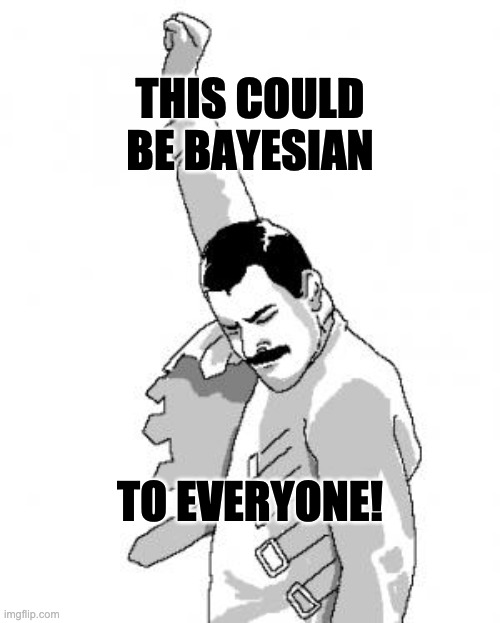

Estatística Bayesiana Bayesiana com R e Stan
================

A disciplina toda foi gravada e disponibilizada no YouTube na playlist
abaixo:

Bayesian for Everyone!

Disciplina de Estatística Bayesiana para alunos de Mestrado e Doutorado.
A disciplina toda está disponível no site
[storopoli.github.io/Estatistica-Bayesiana](https://storopoli.github.io/Estatistica-Bayesiana).

A Estatística Bayesiana é uma abordagem de Estatística inferencial que
não usa hipóteses nulas (*H*0) e *p*-valores. Se você não
sabe o que é um *p*-valor, recomendo olhar [O que é Estatística
Bayesiana](0-Estatistica-Bayesiana.html). Muitos cientistas e
pesquisadores acreditam que sabe o que é um *p*-valor, mas sua
compreensão é falha e imperfeita, por isso, mesmo que você acredite que
saiba o que é um *p*-valor, eu ainda recomendo que veja [O que é
Estatística
Bayesiana](https://storopoli.github.io/Estatistica-Bayesiana/0-Estatistica-Bayesiana.html).

**RStudio**:

## Stan

[Stan](https://mc-stan.org) (Carpenter et al., 2017) é uma plataforma
para modelagem e computação estatística de alto desempenho. Milhares de
usuários contam com Stan para modelagem estatística, análise de dados e
previsão nas ciências sociais, biológicas e físicas, engenharia e
negócios. Stan tem o suporte financeiro da
[NumFOCUS](https://numfocus.org), uma fundação sem fins lucrativos que
dá apoio financeiro à projetos de softwares *opensource*. Dentre os
patrocinadores da NumFOCUS podemos citar AWS Amazon, Bloomberg,
Microsoft, IBM, RStudio, Facebook, NVIDIA, Netflix, entre outras.

Os modelos em Stan são especificados pela sua própria linguagem (similar
à C++) e são compilados em um arquivo executável que gera inferências
estatísticas Bayesiana com amostragem Monte Carlo de correntes Markov
(*Markov Chain Monte Carlo* – MCMC) de alto desempenho. Stan possui
interfaces para as seguintes linguagens de programação (estou riscando
as linguagens que não são *opensource* por uma questão de princípios):

-   R: [`RStan`](https://mc-stan.org/users/interfaces/rstan.html) e
    [`CmdStanR`](https://mc-stan.org/cmdstanr)
-   Python: [`PyStan`](https://mc-stan.org/users/interfaces/pystan.html)
    e
    [`CmdStanPy`](https://cmdstanpy.readthedocs.io/en/latest/getting_started.html)
-   Shell (Linha de Comando):
    [`CmdStan`](https://mc-stan.org/users/interfaces/cmdstan.html)
-   Julia:
    [`Stan.jl`](https://mc-stan.org/users/interfaces/julia-stan.html)
-   Scala: [`ScalaStan`](https://github.com/cibotech/ScalaStan)
-   ~~Matlab:
    [`MatlabStan`](https://mc-stan.org/users/interfaces/matlab-stan.html)~~
-   ~~Stata:
    [`StataStan`](https://mc-stan.org/users/interfaces/stata-stan.html)~~
-   ~~Mathematica:
    [`MathematicaStan`](https://mc-stan.org/users/interfaces/mathematica-stan.html)~~

A linguagem Stan possui uma curva de aprendizagem bem desafiadora, por
isso Stan possui um ecossistema de pacotes de interfaces que muitas
vezes ajudam e simplificam a sua utilização:

-   [`rstanarm`](http://mc-stan.org/rstanarm/): ajuda o usuário a
    especificar modelos usando a síntaxe familiar de fórmulas do R.
-   [`brms`](https://paul-buerkner.github.io/brms/): similar ao
    `rstanarm` pois usa a síntaxe familiar de fórmulas do R, mas dá
    maior flexibilidade na especificação de modelos mais complexos (e
    geralmente a amostragem é um pouco mais rápida que o `rstanarm`).

Stan (e consequentemente todas suas interfaces com diversas linguagens
de programação e todos os pacotes do seu ecossistema) usa um amostrador
MCMC que utiliza dinâmica Hamiltoniana (*Hamiltonian Monte Carlo* – HMC)
para guiar as propostas de amostragem de novos parâmetros no sentido do
gradiente da densidade de probabilidade da posterior. Isto implica em um
amostrador mais eficiente e que consegue explorar todo o espaço amostral
da posterior com menos iterações; e também mais eficaz que consegue
tolerar diferentes geometrias de espaços amostrais da posterior. Em
outras palavras, Stan usa técnicas de amostragem avançadas que permite
com que modelos complexos Bayesianos atinjam convergência de maneira
rápida. No Stan, raramente deve-se ajustar os parâmetros do algoritmo
HMC, pois geralmente os parâmetros padrões (*out-of-the-box*) funcionam
muito bem. Assim, o usuário foca no que é importante: a especificação
dos componentes probabilísticos do seu modelo Bayesiano.

## Professor

Prof. Dr. José Eduardo Storopoli - [Currículo
*Lattes*](http://lattes.cnpq.br/2281909649311607) -
[ORCID](https://orcid.org/0000-0002-0559-5176) -
[CV](https://storopoli.github.io)

<josees@uni9.pro.br>

## Como usar esse conteúdo?

Este conteúdo possui *licença livre para uso* (CC BY-SA). Caso queira
utilizar o conteúdo para um curso ou estudos, por favor colabore nesse
repositório quaisquer aprimorações que foram realizadas. O propósito do
conteúdo não é o rigor matemático geralmente adotado em disciplinas e
tutoriais de estatística Bayesiana, mas gerar uma forte intuição
deixando de lado o rigor matemático e focar no ferramental
(primariamente `rstanarm` e um pouco de `brms`).

Para configurar um ambiente local:

1.  Clone o repositório do GitHub:
    `git clone https://github.com/storopoli/Estatistica-Bayesiana.git`
2.  Acesse o diretório: `cd Estatistica-Bayesiana`
3.  Instale os pacotes necessários: `Rscript .binder/install.R`

## Aulas

-   [**O que é Estatística
    Bayesiana**](https://storopoli.github.io/Estatistica-Bayesiana/0-Estatistica-Bayesiana.html)

1.  [**Comandos Básicos de
    R**](https://storopoli.github.io/Estatistica-Bayesiana/1-Comandos_Basicos.html)
2.  [**Distribuições
    Estatísticas**](https://storopoli.github.io/Estatistica-Bayesiana/2-Distribuicoes_Estatisticas.html)
3.  [**`rstanarm` e `brms`**](3-rstanarm.html)
4.  [**Priors**](https://storopoli.github.io/Estatistica-Bayesiana/4-Priors.html)
5.  [**Markov Chain
    Montecarlo (MCMC)**](https://storopoli.github.io/Estatistica-Bayesiana/5-MCMC.html)
6.  [**Regressão Linear
    Bayesiana**](https://storopoli.github.io/Estatistica-Bayesiana/6-Regressao_Linear.html)
7.  [**Regressão Logística
    Bayesiana**](https://storopoli.github.io/Estatistica-Bayesiana/7-Regressao_Logistica.html)
8.  [**Regressão de Poisson
    Bayesiana**](https://storopoli.github.io/Estatistica-Bayesiana/8-Regressao_Poisson.html)
9.  [**Regressão Robusta
    Bayesiana**](https://storopoli.github.io/Estatistica-Bayesiana/9-Regressao_Robusta.html)
10. [**Modelos
    Multiníveis**](https://storopoli.github.io/Estatistica-Bayesiana/10-Regressao_Multinivel.html)

-   [**Comparação de
    Modelos**](https://storopoli.github.io/Estatistica-Bayesiana/aux-Model_Comparison.html)
-   [**Dados
    Faltantes**](https://storopoli.github.io/Estatistica-Bayesiana/aux-Dados_Faltantes.html)
-   [**Coeficientes de uma
    Regressão**](https://storopoli.github.io/Estatistica-Bayesiana/aux-Regressao_Coeficientes.html)
-   [**Tabelas para
    Publicação**](https://storopoli.github.io/Estatistica-Bayesiana/aux-Tabelas_para_Publicacao.html)

## Referências

### Livros

-   Gelman, A., Carlin, J. B., Stern, H. S., Dunson, D. B., Vehtari, A.,
    & Rubin, D. B. (2013). *Bayesian Data Analysis*. Chapman and
    Hall/CRC.
-   McElreath, R. (2020). *Statistical rethinking: A Bayesian course
    with examples in R and Stan*. CRC press.
-   Gelman, A., Hill, J., & Vehtari, A. (2020). *Regression and other
    stories*. Cambridge University Press.
-   Brooks, S., Gelman, A., Jones, G., & Meng, X.-L. (2011). *Handbook
    of Markov Chain Monte Carlo*. CRC Press.
    <http://books.google.com?id=qfRsAIKZ4rIC>
    -   Geyer, C. J. (2011). Introduction to markov chain monte carlo.
        In S. Brooks, A. Gelman, G. L. Jones, & X.-L. Meng (Eds.),
        *Handbook of markov chain monte carlo*.

### Artigos

#### Básicos

-   van de Schoot, R., Depaoli, S., King, R., Kramer, B., Märtens, K.,
    Tadesse, M. G., Vannucci, M., Gelman, A., Veen, D., Willemsen, J., &
    Yau, C. (2021). Bayesian statistics and modelling. *Nature Reviews
    Methods Primers*, *1*(1, 1), 1–26.
    https://doi.org/[10.1038/s43586-020-00001-2](https://doi.org/10.1038/s43586-020-00001-2)
-   Gabry, J., Simpson, D., Vehtari, A., Betancourt, M., & Gelman, A.
    (2019). Visualization in Bayesian workflow. *Journal of the Royal
    Statistical Society: Series A (Statistics in Society)*, *182*(2),
    389–402.
    https://doi.org/[10.1111/rssa.12378](https://doi.org/10.1111/rssa.12378)
-   Gelman, A., Vehtari, A., Simpson, D., Margossian, C. C., Carpenter,
    B., Yao, Y., Kennedy, L., Gabry, J., Bürkner, P.-C., & Modr’ak, M.
    (2020, November 3). *Bayesian Workflow*.
    <http://arxiv.org/abs/2011.01808>
-   Benjamin, D. J., Berger, J. O., Johannesson, M., Nosek, B. A.,
    Wagenmakers, E.-J., Berk, R., Bollen, K. A., Brembs, B., Brown, L.,
    Camerer, C., Cesarini, D., Chambers, C. D., Clyde, M., Cook, T. D.,
    De Boeck, P., Dienes, Z., Dreber, A., Easwaran, K., Efferson, C., …
    Johnson, V. E. (2018). Redefine statistical significance. *Nature
    Human Behaviour*, *2*(1), 6–10.
    https://doi.org/[10.1038/s41562-017-0189-z](https://doi.org/10.1038/s41562-017-0189-z)
-   Carpenter, B., Gelman, A., Hoffman, M. D., Lee, D., Goodrich, B.,
    Betancourt, M., Brubaker, M., Guo, J., Li, P., & Riddell, A. (2017).
    Stan : A Probabilistic Programming Language. *Journal of Statistical
    Software*, *76*(1).
    https://doi.org/[10.18637/jss.v076.i01](https://doi.org/10.18637/jss.v076.i01)
-   Etz, A. (2018). Introduction to the Concept of Likelihood and Its
    Applications. *Advances in Methods and Practices in Psychological
    Science*, *1*(1), 60–69.
    https://doi.org/[10.1177/2515245917744314](https://doi.org/10.1177/2515245917744314)
-   Etz, A., Gronau, Q. F., Dablander, F., Edelsbrunner, P. A., &
    Baribault, B. (2018). How to become a Bayesian in eight easy steps:
    An annotated reading list. *Psychonomic Bulletin & Review*, *25*(1),
    219–234.
    https://doi.org/[10.3758/s13423-017-1317-5](https://doi.org/10.3758/s13423-017-1317-5)
-   McShane, B. B., Gal, D., Gelman, A., Robert, C., & Tackett, J. L.
    (2019). Abandon Statistical Significance. *American Statistician*,
    *73*, 235–245.
    https://doi.org/[10.1080/00031305.2018.1527253](https://doi.org/10.1080/00031305.2018.1527253)
-   Amrhein, V., Greenland, S., & McShane, B. (2019). Scientists rise up
    against statistical significance. *Nature*, *567*(7748), 305–307.
    https://doi.org/[10.1038/d41586-019-00857-9](https://doi.org/10.1038/d41586-019-00857-9)
-   van Ravenzwaaij, D., Cassey, P., & Brown, S. D. (2018). A simple
    introduction to Markov Chain Monte–Carlo sampling. *Psychonomic
    Bulletin and Review*, *25*(1), 143–154.
    https://doi.org/[10.3758/s13423-016-1015-8](https://doi.org/10.3758/s13423-016-1015-8)
-   Vandekerckhove, J., Matzke, D., Wagenmakers, E.-J., & others.
    (2015). Model comparison and the principle of parsimony. In J. R.
    Busemeyer, Z. Wang, J. T. Townsend, & A. Eidels (Eds.), *Oxford
    handbook of computational and mathematical psychology* (pp.
    300–319). Oxford University Press Oxford.
-   van de Schoot, R., Kaplan, D., Denissen, J., Asendorpf, J. B.,
    Neyer, F. J., & van Aken, M. A. G. (2014). A Gentle Introduction to
    Bayesian Analysis: Applications to Developmental Research. *Child
    Development*, *85*(3), 842–860.
    https://doi.org/[10.1111/cdev.12169](https://doi.org/10.1111/cdev.12169)
    \_eprint:
    https://srcd.onlinelibrary.wiley.com/doi/pdf/10.1111/cdev.12169
-   Wagenmakers, E.-J. (2007). A practical solution to the pervasive
    problems of p values. *Psychonomic Bulletin & Review*, *14*(5),
    779–804.
    https://doi.org/[10.3758/BF03194105](https://doi.org/10.3758/BF03194105)

#### Complementares

-   Cohen, J. (1994). The earth is round (p &lt; .05). *American
    Psychologist*, *49*(12), 997–1003.
    https://doi.org/[10.1037/0003-066X.49.12.997](https://doi.org/10.1037/0003-066X.49.12.997)
-   Dienes, Z. (2011). Bayesian Versus Orthodox Statistics: Which Side
    Are You On? *Perspectives on Psychological Science*, *6*(3),
    274–290.
    https://doi.org/[10.1177/1745691611406920](https://doi.org/10.1177/1745691611406920)
-   Etz, A., & Vandekerckhove, J. (2018). Introduction to Bayesian
    Inference for Psychology. *Psychonomic Bulletin & Review*, *25*(1),
    5–34.
    https://doi.org/[10.3758/s13423-017-1262-3](https://doi.org/10.3758/s13423-017-1262-3)
-   J’unior, C. A. M. (2020). Quanto vale o valor-p? *Arquivos de
    Ciências Do Esporte*, *7*(2).
-   Kerr, N. L. (1998). HARKing: Hypothesizing after the results are
    known. *Personality and Social Psychology Review*, *2*(3), 196–217.
    https://doi.org/[10.1207/s15327957pspr0203\_4](https://doi.org/10.1207/s15327957pspr0203_4)
-   Kruschke, J. K., & Vanpaemel, W. (2015). Bayesian estimation in
    hierarchical models. In J. R. Busemeyer, Z. Wang, J. T. Townsend,
    & A. Eidels (Eds.), *The Oxford handbook of computational and
    mathematical psychology* (pp. 279–299). Oxford University Press
    Oxford, UK.
-   Kruschke, J. K., & Liddell, T. M. (2018). Bayesian data analysis for
    newcomers. *Psychonomic Bulletin & Review*, *25*(1), 155–177.
    https://doi.org/[10.3758/s13423-017-1272-1](https://doi.org/10.3758/s13423-017-1272-1)
-   Kruschke, J. K., & Liddell, T. M. (2018). The Bayesian New
    Statistics: Hypothesis testing, estimation, meta-analysis, and power
    analysis from a Bayesian perspective. *Psychonomic Bulletin &
    Review*, *25*(1), 178–206.
    https://doi.org/[10.3758/s13423-016-1221-4](https://doi.org/10.3758/s13423-016-1221-4)
-   Lakens, D., Adolfi, F. G., Albers, C. J., Anvari, F., Apps, M. A.
    J., Argamon, S. E., Baguley, T., Becker, R. B., Benning, S. D.,
    Bradford, D. E., Buchanan, E. M., Caldwell, A. R., Van Calster, B.,
    Carlsson, R., Chen, S. C., Chung, B., Colling, L. J., Collins, G.
    S., Crook, Z., … Zwaan, R. A. (2018). Justify your alpha. *Nature
    Human Behaviour*, *2*(3), 168–171.
    https://doi.org/[10.1038/s41562-018-0311-x](https://doi.org/10.1038/s41562-018-0311-x)
-   Morey, R. D., Hoekstra, R., Rouder, J. N., Lee, M. D., &
    Wagenmakers, E.-J. (2016). The fallacy of
    placing confidence in confidence intervals. *Psychonomic
    Bulletin & Review*, *23*(1), 103–123.
    https://doi.org/[10.3758/s13423-015-0947-8](https://doi.org/10.3758/s13423-015-0947-8)
-   Murphy, K. R., & Aguinis, H. (2019). HARKing: How Badly Can
    Cherry-Picking and Question Trolling Produce Bias in Published
    Results? *Journal of Business and Psychology*, *34*(1).
    https://doi.org/[10.1007/s10869-017-9524-7](https://doi.org/10.1007/s10869-017-9524-7)
-   Stark, P. B., & Saltelli, A. (2018). Cargo-cult statistics and
    scientific crisis. *Significance*, *15*(4), 40–43.
    https://doi.org/[10.1111/j.1740-9713.2018.01174.x](https://doi.org/10.1111/j.1740-9713.2018.01174.x)

## Conteúdos Similares

Existem alguns conteúdos em português similares que eu indico:

-   Marco Inácio — [Apostila de Stan](https://marcoinacio.com/stan/)

    Um dos desenvolvedores da equipe do Stan. A apostila está um pouco
    desatualizada (2018). O foco é o rigor matemático e a linguagem
    Stan. Muito bem escrita e com bons exemplos.

-   Ricardo Ehlers (USP) — [Inferência Bayesiana (Notas de
    Aula)](https://sites.icmc.usp.br/ehlers/bayes/)

    Notas de uma disciplina da USP pelo professor Ricardo Ehlers. O foco
    é o rigor matemática e as ferramentas utilizadas são desatualizadas
    (BUGS e JAGS). Também muito bem escrita e com bons exemplos.

-   Luís Gustavo Esteves, Rafael Izbicki e Rafael Bassi Stern (UFSCar) —
    [Inferência Bayesiana (Notas de
    Aula)](https://github.com/rbstern/bayesian_inference_book)

    Notas de uma disciplina da UFSCar pelos professores Luís Gustavo
    Esteves, Rafael Izbicki e Rafael Bassi Stern. O foco é o rigor
    matemático, mas o conteúdo é um pouco mais acessível com uma forte
    introdução à lógica Bayesiana. Fala um pouco da linguagem Stan e sua
    interface do R (`rstan`) no finalzinho.

## Como citar esse conteúdo

Para citar o conteúdo use:

    Storopoli (2021). Estatística Bayesiana com R e Stan. Disponível em: https://storopoli.github.io/Estatistica-Bayesiana.

Ou em formato BibTeX para LaTeX:

    @misc{storopoli2021estatisticabayesianaR,
      author = {Storopoli, Jose},
      title = {Estatística Bayesiana com R e Stan},
      url = {https://storopoli.github.io/Estatistica-Bayesiana},
      year = {2021}
    }

## Licença

Este obra está licenciado com uma Licença [Creative Commons
Atribuição-CompartilhaIgual 4.0
Internacional](http://creativecommons.org/licenses/by-sa/4.0/).

